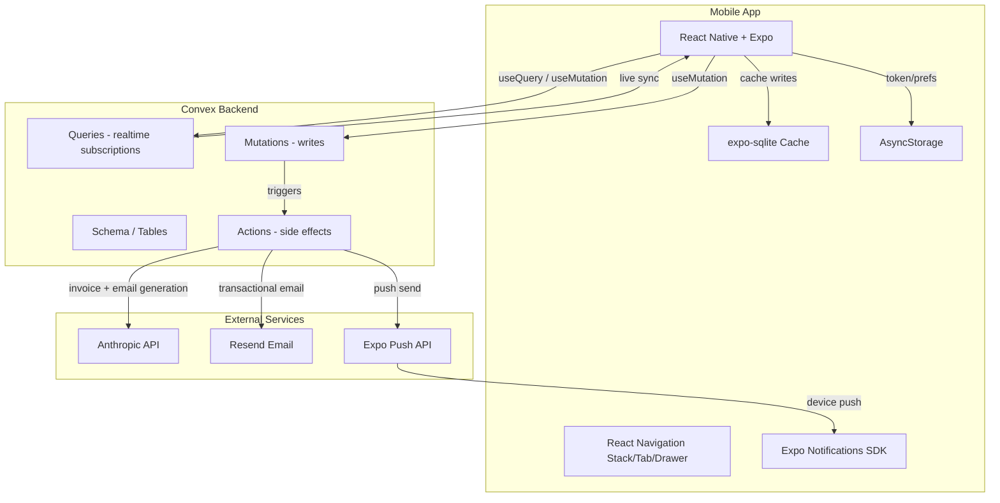

# Flowdesk — Architecture

**Version:** 1.0  
**Last Updated:** 2026-04-05  

---

## 1. Overview

Flowdesk is a real-time mobile application built on a serverless reactive stack. The frontend is a React Native + Expo app that subscribes to Convex queries for live data — no polling, no REST layer. All business logic lives in Convex functions (queries, mutations, actions). AI invoice generation and email composition happen in Convex actions (server-side), keeping API keys off the device. Local SQLite and AsyncStorage provide an offline read layer. Push notifications are triggered server-side from Convex actions via the Expo Push API.

The architecture prioritizes: real-time sync over eventual consistency, server-side AI execution for security, and a clean role-based navigation split between freelancer and client.

---

## 2. System Diagram



---

## 3. Components

### 3.1 React Native + Expo (Frontend)

**Purpose:** Full mobile UI for both freelancer and client roles.

**Framework:** React Native with Expo managed workflow, TypeScript.

**Key responsibilities:**
- Role-based navigation (separate navigator trees for freelancer and client)
- Real-time UI via Convex `useQuery` subscriptions
- Offline read via SQLite cache (contracts, tasks, messages)
- Auth token + user prefs via AsyncStorage
- Push token registration on launch
- AI invoice editing UI before send

**Key screens:**
- Auth: Login, Register, Role Selection
- Freelancer: Dashboard, Contract List, Contract Detail, Task List, Invoice Draft, Invoice Send, Chat, Notifications, Profile
- Client: Dashboard, Pending Contracts, Contract Detail, Invoice View, Payment Simulation, Chat, Notifications, Profile

---

### 3.2 Convex Backend

**Purpose:** Realtime database, auth, business logic, and server-side action execution.

**Framework:** Convex (TypeScript)

**Key responsibilities:**
- Schema definition and data persistence
- Real-time query subscriptions to the mobile client
- Mutations for all write operations (create contract, update task, send message, etc.)
- Actions for side effects: Anthropic API calls, Resend emails, Expo push sends
- Convex Auth for user session management
- Push token storage per user

---

### 3.3 Anthropic API (AI Layer)

**Purpose:** Two AI tasks — outreach email generation and invoice generation.

**Called from:** Convex actions (server-side only, key never exposed to client)

**Task 1 — Email generation:**  
Input: freelancer name, client name, project title, tone (formal/friendly/casual)  
Output: subject line + email body string

**Task 2 — Invoice generation:**  
Input: contract type, tasks array (title, timeSpent, hourlyRate), fixedPrice, clientName  
Output: JSON — `{ lineItems: [{description, hours, rate, amount}], subtotal, tax, total, notes }`

---

### 3.4 Resend (Email)

**Purpose:** Transactional email at 3 lifecycle moments.

**Triggers:**
1. Client accepts contract → email to freelancer + thank-you email to client
2. Invoice sent → email to client with invoice summary + payment CTA
3. Payment simulated → email to freelancer (paid confirmation) + email to client (deliverable link)

**Template:** Plain HTML, minimal, Flowdesk-branded.

---

### 3.5 Expo Push API (Notifications)

**Purpose:** Remote push notifications triggered from Convex actions.

**Flow:** On key mutations, a Convex action reads the target user's stored `pushToken` and sends a push via `https://exp.host/--/api/v2/push/send`.

---

## 4. Key Data Flows

### 4.1 Freelancer Creates Contract

```text
1. Freelancer fills contract form → taps Submit
2. useMutation('contracts:create') called with form data
3. Convex mutation: inserts contract (status: pending), stores clientEmail
4. Mutation schedules Convex action: generateOutreachEmail
5. Action calls Anthropic API → returns email copy
6. Action calls Resend → sends email to clientEmail
7. If client has account: Action calls Expo Push API → sends push to client
8. Client receives push: "Someone wants to work with you"
9. Freelancer dashboard updates in real time (new contract visible)
```

### 4.2 Client Accepts Contract

```text
1. Client taps Accept on pending contract
2. useMutation('contracts:accept') called
3. Convex mutation: updates contract status to 'active'
4. Mutation schedules action: onContractAccepted
5. Action calls Resend → email to freelancer + email to client
6. Action calls Expo Push API → push to freelancer
7. Freelancer push: "Your contract was accepted"
8. Both dashboards update in real time
```

### 4.3 Task Completed → 100% → Invoice Generated

```text
1. Freelancer marks last task as 'completed'
2. useMutation('tasks:complete') called
3. Convex mutation: sets completedAt, calculates timeSpent
4. Mutation recalculates completionPercent on contract
5. If completionPercent === 100:
   a. Mutation updates contract completionPercent
   b. Schedules action: notifyClientProjectComplete
   c. Action sends push to client
6. Freelancer taps "Generate Invoice"
7. useMutation('invoices:generate') → schedules action: generateInvoice
8. Action calls Anthropic API with all task + contract data
9. Returns structured invoice JSON
10. Invoice saved to DB as status: 'draft'
11. Freelancer sees editable invoice draft screen
```

### 4.4 Payment Simulation → Deliverable Release

```text
1. Client taps "Pay" on invoice screen
2. useMutation('invoices:simulatePayment') called
3. Convex mutation: updates invoice status to 'paid'
4. Schedules action: onPaymentConfirmed
5. Action calls Resend → email to freelancer (payment confirmation)
6. Action calls Resend → email to client (deliverable link)
7. Action calls Expo Push API → push to freelancer
8. Action calls Expo Push API → push to client (with deliverable link)
9. Contract status updated to 'completed'
```

---

## 5. External Services

| Service | Purpose | Notes |
|---|---|---|
| Convex | Realtime DB + auth + server actions | Free tier: 1M function calls/month |
| Anthropic API | AI email + invoice generation | Pay per token, claude-sonnet-4-20250514 |
| Resend | Transactional email | Free: 3,000 emails/month |
| Expo Push API | Remote push notifications | Free, no account required |
| NabooPay | Payment simulation only (no real calls) | UI mock for demo |
| Stripe | Payment simulation only (no real calls) | UI mock for demo |

---

## 6. Scalability Notes

**Current constraints:**
- Convex free tier limits apply (1M function calls, 8GB storage)
- Expo managed workflow limits native module access
- SQLite cache is not encrypted (acceptable for demo, needs review for production)
- No background sync — cache updates only when app is in foreground or on resume

**Path to scale:**
- Move to Convex Pro for higher limits as user base grows
- Add background fetch for cache sync via Expo Background Fetch
- Introduce Convex file storage for deliverable upload (currently link-only)
- Add real Stripe + NabooPay webhooks when payment goes live
- Split freelancer and client into separate Expo apps if UX complexity grows
