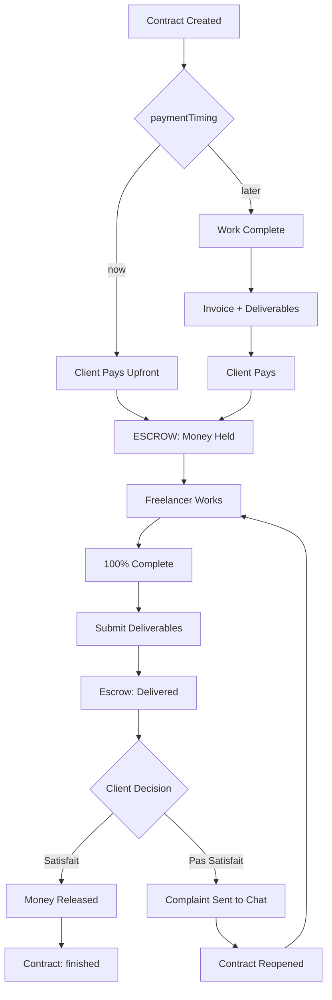

# Payment Flow Consolidated Plan

## Overview

This is the **single source of truth** for all payment-related work in FlowDesk. Consolidates:
- `payment-flow-enhancement-plan.md` (escrow system)
- `payment-flow-bugfixes-plan.md` (5 bug fixes)
- `bugfix-fixed-price-payment-plan.md` (fixed price bugs)
- `pay-now-payment-flow-fix.md` (Pay Now flow fix)

## Payment Flow Types

### Flow A: "Pay Now" + Fixed Price (Escrow)
```
Client Pays → [ESCROW] → Freelancer Works → Freelancer Submits → 
Client:
  ├─ "Satisfait" → Money to Freelancer → Contract "finished"
  └─ "Pas Satisfait" → Complaint → Contract Reopens → Dispute
```

### Flow B: "Pay Now" + Hourly Rate (Escrow)
```
Client Pays (initial/estimated) → [ESCROW] → Freelancer Works → Track Hours →
Work Complete → Client Satisfait → Money Released
OR:
Work Complete → Client Pas Satisfait → Dispute → Contract Reopens
```

### Flow C: "Pay Later" (with Escrow)
```
Freelancer Works → Invoice + Deliverables → Client Pays (money held) →
Client reviews:
  ├─ Satisfait → Money Released → Contract "finished"
  └─ Pas Satisfait → Dispute → Contract Reopens
```

**Key Principle**: Money is ALWAYS held in escrow until the client says they're satisfied.

---

## Issues to Fix

### Issue 1: "Pay Now" - Client Not Prompted to Pay on Accept
- **Severity**: Critical
- **Files**: `app/(client)/contracts/[id]/index.tsx`, `app/(client)/contracts/[id]/invoice.tsx`
- **Problem**: Client accepts contract → status becomes "active" → nothing else happens. Payment only happens later via invoice.
- **Expected**: Client accepts "Pay Now" contract → Payment flow triggers immediately → Money held in escrow

### Issue 2: Fixed Price "Pay Later" Shows Hourly UI
- **Severity**: High
- **File**: `app/(freelancer)/contracts/[id]/invoice.tsx`
- **Problem**: Fixed price "Pay Later" shows line items, AI generation, etc.
- **Expected**: Show fixed price amount + deliverables input only

### Issue 3: Deliverable Links Not in Invoice Email
- **Severity**: Medium
- **File**: `convex/email.ts`
- **Problem**: `sendPaymentReceivedEmail` doesn't include deliverable links
- **Expected**: Include deliverables in payment confirmation email

### Issue 4: Hourly "Pay Later" - Can't Add Deliverable Links
- **Severity**: Medium
- **File**: `app/(freelancer)/contracts/[id]/invoice.tsx`
- **Problem**: Invoice has `deliverables` field but UI doesn't show deliverables input
- **Expected**: Show deliverables section for all "Pay Later" invoices

### Issue 5: Timer Shows for Non-Hourly Contracts
- **Severity**: Low
- **File**: `app/(freelancer)/contracts/[id]/tasks.tsx`
- **Problem**: Timer component shown for all task items
- **Expected**: Hide timer when `pricingType === "fixed"`

### Issue 6: Fixed Price Pay Now - Wrong Mutation Called
- **Severity**: Critical
- **File**: `app/(client)/contracts/[id]/invoice.tsx` line 24
- **Problem**: Uses `simulatePayment` which expects `invoiceId`, but Pay Now doesn't have an invoice yet
- **Expected**: Use `simulatePaymentNow` mutation for Pay Now

### Issue 7: Fixed Price Pay Now - Freelancer Cannot Send Invoice
- **Severity**: High
- **File**: `app/(freelancer)/contracts/[id]/invoice.tsx` line 85
- **Problem**: `handleCreateFixedInvoice` calls `updateInvoice(null, ...)` but `updateInvoice` requires valid `invoiceId`
- **Expected**: For Pay Now fixed price, no invoice needed - just add deliverables after completing work

### Issue 8: Fixed Price Pay Later - invoiceId is null Error
- **Severity**: High
- **File**: `app/(freelancer)/contracts/[id]/invoice.tsx` line 85
- **Problem**: Same code path - calling `updateInvoice` with `null` invoiceId
- **Expected**: For Pay Later fixed price, first CREATE the invoice, then send it

---

## Implementation Plan

### Phase 1: Backend Mutations

#### 1.1 Add `simulatePaymentNow` mutation
**File**: `convex/invoices.ts`
- Takes `contractId` instead of `invoiceId`
- Directly sets escrowStatus to "held"
- Updates contract to active
- Sends notification to freelancer

```typescript
export const simulatePaymentNow = mutation({
  args: { contractId: v.id("contracts") },
  handler: async (ctx, args) => {
    const contract = await ctx.db.get(args.contractId);
    if (!contract) throw new ConvexError("Contract not found");
    if (contract.paymentTiming !== "now") {
      throw new ConvexError("Contract is not Pay Now");
    }
    
    // Money is held in escrow
    await ctx.db.patch(contract._id, {
      escrowStatus: "held",
      escrowPaidAt: Date.now(),
      status: "active",
    });
    
    // Notify freelancer to start work
    await ctx.scheduler.runAfter(0, internalAny.actions.push.sendPaymentReceivedNotification, {
      contractId: contract._id,
    });
  },
});
```

#### 1.2 Add `submitCompletion` mutation
**File**: `convex/contracts.ts`
- Freelancer submits deliverables after work is done
- Changes escrowStatus from "held" to "delivered"

#### 1.3 Add `approveDelivery` mutation
**File**: `convex/contracts.ts`
- Client approves work
- Changes escrowStatus from "delivered" to "released"
- Sets contract status to "finished"

#### 1.4 Add `disputeDelivery` mutation
**File**: `convex/contracts.ts`
- Client raises dispute
- Sends complaint to chat
- Reopens contract

#### 1.5 Update `simulatePayment` for Pay Later
**File**: `convex/invoices.ts`
- For "Pay Later" contracts: money is paid but HELD until satisfaction
- Set escrowStatus to "delivered"

### Phase 2: Email Updates

#### 2.1 Include Deliverables in Payment Email
**File**: `convex/email.ts`
- Update `sendPaymentReceivedEmail` to include deliverable links

### Phase 3: Frontend Fixes

#### 3.1 Client Contract Detail - Accept & Pay
**File**: `app/(client)/contracts/[id]/index.tsx`

```typescript
const handleAccept = async () => {
  if (!contractId) return;
  try {
    await acceptContract({ contractId });
    
    // If Pay Now, redirect to payment
    if (contract.paymentTiming === "now") {
      router.push(`/contracts/${contractId}/invoice`);
    }
  } catch (error) {
    Alert.alert("Error", "Failed to accept contract");
  }
};
```

#### 3.2 Client Invoice Screen - Pay Now Flow
**File**: `app/(client)/contracts/[id]/invoice.tsx`

- Change `simulatePayment` to `simulatePaymentNow`
- For Pay Now with NO invoice and `escrowStatus !== "held"` → Show payment form immediately

```typescript
{isPayNow && !hasInvoice && contract.status === "active" && contract.escrowStatus !== "held" && (
  <Card style={styles.payNowCard}>
    <Typography variant="body">Upfront Payment Required</Typography>
    <View style={styles.priceSection}>
      <Typography variant="h2">${contract.fixedPrice?.toFixed(2) || "0.00"}</Typography>
    </View>
    <PaymentSimulation
      total={contract.fixedPrice ?? 0}
      onPayment={handlePayment}
      preferredMethod={contract.paymentMethod}
    />
  </Card>
)}
```

#### 3.3 Freelancer Invoice Screen - Fixed Price Pay Later
**File**: `app/(freelancer)/contracts/[id]/invoice.tsx`

**For Fixed Price Pay Later:**
- First CREATE the invoice using `createInvoice`
- Then user can edit and send it

**For Fixed Price Pay Now:**
- Remove invoice creation
- Just show deliverables section
- Client pays upfront first

```typescript
const isFixedPayLater = contract.pricingType === "fixed" && contract.paymentTiming === "later";
const isFixedPayNow = contract.pricingType === "fixed" && contract.paymentTiming === "now";

{!hasInvoice && isFixedPayLater && (
  // Show create invoice form
)}

{!hasInvoice && isFixedPayNow && (
  // Show deliverables section only - no invoice needed
)}

{hasInvoice && (
  // Show invoice with deliverables input for Pay Later
)}
```

#### 3.4 Freelancer Invoice Screen - Add Deliverables for Pay Later
**File**: `app/(freelancer)/contracts/[id]/invoice.tsx`

```typescript
{!isPayNow && hasInvoice && (
  <Card style={styles.deliverablesCard}>
    <DeliverableLinks
      deliverables={invoice.deliverables ?? contract.deliverables ?? []}
      editable={isDraft}
      onChange={(newDeliverables) => {
        updateInvoice(invoice._id, { deliverables: newDeliverables });
      }}
    />
  </Card>
)}
```

#### 3.5 Tasks Screen - Hide Timer for Fixed Price
**File**: `app/(freelancer)/contracts/[id]/tasks.tsx`

```typescript
{contract.pricingType === "hourly" && (
  <TimerControl ... />
)}
```

---

## Files to Modify

| File | Changes |
|------|---------|
| `convex/schema.ts` | Add `escrowStatus`, `escrowPaidAt`, `escrowReleasedAt` fields (if not exists) |
| `convex/invoices.ts` | Add `simulatePaymentNow` mutation, update `simulatePayment` for escrow |
| `convex/contracts.ts` | Add `submitCompletion`, `approveDelivery`, `disputeDelivery` mutations |
| `convex/email.ts` | Include deliverables in payment email |
| `convex/actions/push.ts` | Add notification actions for escrow events |
| `app/(client)/contracts/[id]/index.tsx` | Redirect to payment on accept for Pay Now |
| `app/(client)/contracts/[id]/invoice.tsx` | Fix Pay Now flow, use `simulatePaymentNow` |
| `app/(freelancer)/contracts/[id]/invoice.tsx` | Fix fixed price flows, add deliverables for Pay Later |
| `app/(freelancer)/contracts/[id]/tasks.tsx` | Hide timer for fixed price |
| `hooks/useInvoice.ts` | Add `useSimulatePaymentNow` hook |

---

## Flow Diagram



---

## Testing Checklist

- [ ] Client pays upfront for fixed-price → money held in escrow
- [ ] Freelancer completes work → submits deliverables
- [ ] Client sees "Satisfait/Pas Satisfait" buttons
- [ ] Client clicks "Satisfait" → money released to freelancer
- [ ] Client clicks "Pas Satisfait" → complaint field appears
- [ ] Complaint sent to chat with template
- [ ] Contract reopens after dispute
- [ ] Push notifications sent at each step
- [ ] Emails sent at each step (with deliverables)
- [ ] Timer hidden for fixed-price contracts
- [ ] Fixed price Pay Later shows simple invoice UI
- [ ] Deliverable links included in invoice email
