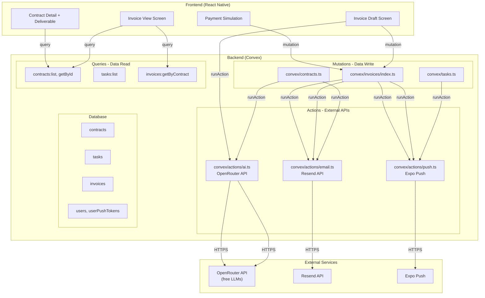

# Sprint 3 — AI Layer + Invoice + Payment Simulation

**Goal:** AI email generation wired into contract creation; AI invoice generation on-demand by freelancer; payment simulation releases deliverable.  
**Deliverable:** Full lifecycle demo-ready: create contract → AI email → work → 100% → freelancer generates AI invoice → edit → send → client pays → deliverable link received.

---

## Key Changes from Original Plan

1. **Invoice generation is manual** - Freelancer clicks "Generate Invoice" button, not auto-triggered at 100%
2. **Switch from Anthropic to OpenRouter** - Using OpenRouter free tier (no API cost)

---

## Architecture Overview

```
┌─────────────────────────────────────────────────────────────────────────┐
│                           SPRINT 3 FLOW                                 │
├─────────────────────────────────────────────────────────────────────────┤
│                                                                          │
│  [Freelancer]                    [Client]                               │
│       │                              │                                   │
│       │  contracts:create ──────────►│  AI outreach email (Resend)      │
│       │                              │                                   │
│       │                        contracts:accept                         │
│       │◄─────────────────────────────│  Accept email (Resend)           │
│       │                              │                                   │
│       │  Add tasks, work             │                                   │
│       │  Timer start/stop            │                                   │
│       │                              │                                   │
│       │  ── 100% completion ────────►│  Push: work complete             │
│       │                              │                                   │
│       │  Click "Generate Invoice"    │                                   │
│       │  (calls OpenRouter AI)       │                                   │
│       │  Invoice: draft ────────────►│  View invoice                    │
│       │                              │                                   │
│       │  Invoice: sent ◄────────────│  Push: invoice received           │
│       │                              │                                   │
│       │                        simulatePayment                         │
│       │◄─────────────────────────────│  Payment email (Resend)           │
│       │  Push: payment received      │                                   │
│       │  deliverableLink released ──►│  Get deliverable link             │
│                                                                          │
└─────────────────────────────────────────────────────────────────────────┘
```

---

## File Structure

```
convex/
  actions/
    ai.ts          # OpenRouter API calls (email + invoice generation)
    email.ts       # Resend email triggers (3 events)
    push.ts        # Expo push notification sender
  invoices/
    actions/
      generateInvoice.ts  # AI invoice generation (action)
    index.ts       # Invoice queries and mutations (CRUD)
  contracts.ts     # MODIFIED: wire AI email
  tasks.ts         # MODIFIED: wire push at 100% completion

hooks/
  useInvoice.ts    # Invoice state management

lib/
  formatting.ts    # Currency, duration, date formatters

src/components/
  invoice/
    InvoiceLineItems.tsx    # Editable line item row
    InvoiceSummary.tsx      # Subtotal, tax, total display
    PaymentSimulation.tsx   # Stripe/NabooPay mock UI

app/(freelancer)/
  contracts/[id]/
    invoice.tsx            # Invoice draft screen (editable)
app/(client)/
  contracts/[id]/
    invoice.tsx            # Invoice view + payment screen
```

---

## API Integrations

### 1. OpenRouter API (`convex/actions/ai.ts`)

**Purpose:** Generate professional emails and invoices using free LLMs via OpenRouter

**Available Free Models on OpenRouter:**
- `google/gemini-2.0-flash-thinking-exp:free`
- `google/gemini-2.0-flash-exp:free`
- `deepseek/deepseek-chat-v3-0324:free`
- `qwen/qwen2.5-72b-instruct:free`

**Functions:**
- `generateOutreachEmail(contract, tone)` → `{ subject, body }`
- `generateInvoiceFromTasks(contract, tasks)` → `{ lineItems, notes }`

**Implementation:**
```typescript
// convex/actions/ai.ts
"use node";
import { action } from "../_generated/server";
import { v } from "convex/values";

export const generateOutreachEmail = action({
  args: {
    clientName: v.string(),
    clientEmail: v.string(),
    freelancerName: v.string(),
    contractTitle: v.string(),
    tone: v.union(v.literal("formal"), v.literal("friendly"), v.literal("casual")),
  },
  returns: v.object({ subject: v.string(), body: v.string() }),
  handler: async (ctx, args) => {
    const prompt = buildEmailPrompt(args);
    const response = await fetch("https://openrouter.ai/api/v1/chat/completions", {
      method: "POST",
      headers: {
        "Authorization": `Bearer ${process.env.OPENROUTER_API_KEY}`,
        "Content-Type": "application/json",
        "HTTP-Referer": "https://flowdesk.app",
        "X-Title": "FlowDesk",
      },
      body: JSON.stringify({
        model: "google/gemini-2.0-flash-exp:free",
        messages: [{ role: "user", content: prompt }],
        temperature: 0.7,
      }),
    });
    const data = await response.json();
    return parseEmailResponse(data);
  },
});
```

### 2. Resend Email (`convex/actions/email.ts`)

**Purpose:** Send transactional emails via Resend

**Email Events:**
| Event | Recipients | Content |
|-------|------------|---------|
| `contract_created` | Client | AI-generated outreach email |
| `contract_accepted` | Freelancer + Client | Confirmation with contract details |
| `invoice_sent` | Client | Invoice summary + link |
| `payment_received` | Freelancer | Payment confirmation + deliverable |

**Implementation:**
```typescript
// convex/actions/email.ts
"use node";
import { action } from "../_generated/server";

export const sendEmail = action({
  args: { to: v.string(), subject: v.string(), html: v.string() },
  returns: v.object({ success: v.boolean(), messageId: v.string() }),
  handler: async (ctx, args) => {
    const response = await fetch("https://api.resend.com/emails", {
      method: "POST",
      headers: {
        "Authorization": `Bearer ${process.env.RESEND_API_KEY}`,
        "Content-Type": "application/json",
      },
      body: JSON.stringify({
        from: "FlowDesk <noreply@flowdesk.app>",
        to: args.to,
        subject: args.subject,
        html: args.html,
      }),
    });
    const result = await response.json();
    return { success: response.ok, messageId: result.id };
  },
});
```

### 3. Expo Push (`convex/actions/push.ts`)

**Purpose:** Send push notifications to mobile clients

**Notification Events:**
| Event | Recipient | Content |
|-------|-----------|---------|
| `task_complete` (at 100%) | Client | "All tasks completed! Review invoice" |
| `invoice_received` | Client | "New invoice from {freelancer}" |
| `payment_received` | Freelancer | "Payment received! Release deliverable" |

**Implementation:**
```typescript
// convex/actions/push.ts
"use node";
import { action } from "../_generated/server";
import { v } from "convex/values";

export const sendPushNotification = action({
  args: {
    userId: v.id("users"),
    title: v.string(),
    body: v.string(),
    data: v.optional(v.object({ contractId: v.optional(v.id("contracts")) })),
  },
  returns: v.null(),
  handler: async (ctx, args) => {
    // Get user's push tokens
    const tokens = await ctx.runQuery(api.users.getPushTokens, { userId: args.userId });
    
    if (!tokens || tokens.length === 0) return null;

    // Send to all user devices
    const messages = tokens.map((token) => ({
      to: token.token,
      title: args.title,
      body: args.body,
      data: args.data,
    }));

    await fetch("https://exp.host/--/api/v2/push/send", {
      method: "POST",
      headers: { "Content-Type": "application/json" },
      body: JSON.stringify(messages),
    });

    return null;
  },
});
```

---

## Invoice Module (`convex/invoices/index.ts`)

### Queries
- `getByContract(contractId)` → Invoice | null
- `listByFreelancer()` → Invoice[]

### Mutations
- `create(contractId, lineItems, subtotal, tax, total, aiGenerated, notes)` → Id
- `update(InvoiceId, lineItems?, subtotal?, tax?, total?, notes?)` → null
- `send(invoiceId)` → null (triggers push + email)
- `simulatePayment(invoiceId)` → null (releases deliverable)

### Actions
- `generateInvoiceFromTasks(contractId)` → Id (calls OpenRouter AI, creates draft)

---

## Wiring Plan

### 1. Contract Creation → AI Email (`contracts.ts:create`)
```typescript
// After inserting contract, call AI + email action
const email = await ctx.runAction(internal.actions.ai.generateOutreachEmail, {
  clientName: args.clientName, clientEmail: args.clientEmail,
  freelancerName: freelancer.name, contractTitle: args.title,
  tone: args.aiEmailTone,
});
await ctx.runAction(internal.actions.email.sendEmail, {
  to: args.clientEmail, subject: email.subject, html: email.body,
});
```

### 2. Contract Acceptance → Email (`contracts.ts:accept`)
```typescript
// After updating status, send accept emails
await ctx.runAction(internal.actions.email.sendContractAccepted, { contractId });
```

### 3. 100% Task Completion → Push (`tasks.ts:stopTimer`)
```typescript
// After completing task, check if all tasks done
const allTasks = await ctx.db.query("tasks").withIndex("by_contract", ...).collect();
const completionPercent = calculateCompletion(allTasks);
if (completionPercent === 100) {
  await ctx.db.patch(args.contractId, { completionPercent: 100 });
  await ctx.runAction(internal.actions.push.sendPushNotification, {
    userId: contract.clientId, title: "Work Complete!", body: "All tasks done. Ready to generate invoice.",
  });
}
```

### 4. Manual Invoice Generation (Freelancer-Initiated)
```typescript
// Called when freelancer clicks "Generate Invoice" button
// convex/invoices/actions/generateInvoice.ts
export const generateInvoiceFromTasks = action({
  args: { contractId: v.id("contracts") },
  returns: v.id("invoices"),
  handler: async (ctx, args) => {
    // Get contract and tasks
    const contract = await ctx.runQuery(api.contracts.getById, { contractId: args.contractId });
    const tasks = await ctx.runQuery(api.tasks.list, { contractId: args.contractId });
    
    // Call OpenRouter AI
    const invoiceData = await callOpenRouterAI({ contract, tasks });
    
    // Create invoice record
    const invoiceId = await ctx.runMutation(api.invoices.create, {
      contractId: args.contractId,
      lineItems: invoiceData.lineItems,
      subtotal: invoiceData.subtotal,
      tax: invoiceData.tax,
      total: invoiceData.total,
      aiGenerated: true,
      notes: invoiceData.notes,
    });
    
    return invoiceId;
  },
});
```

### 5. Invoice Send → Push + Email (`invoices/index.ts:send`)
```typescript
await ctx.runAction(internal.actions.push.sendPushNotification, { ... });
await ctx.runAction(internal.actions.email.sendInvoiceEmail, { ... });
```

### 6. Payment Simulation → Deliverable Release + Push + Email
```typescript
// invoices/index.ts:simulatePayment
await ctx.runAction(internal.actions.email.sendPaymentReceived, { ... });
await ctx.runAction(internal.actions.push.sendPushNotification, { ... });
// Patch contract: status="completed", deliverableLink released
// Send deliverable email to client
```

---

## Frontend Screens

### 1. Invoice Draft Screen (`app/(freelancer)/contracts/[id]/invoice.tsx`)

**Features:**
- Display contract details + task summary
- "Generate with AI" button (calls OpenRouter, creates draft)
- Show AI-generated line items (editable) after generation
- Add/remove line items manually
- Edit description, hours, rate, amount per line
- Tax rate input (default 0%)
- Real-time total calculation
- "Send Invoice" button (only if status === "draft")

**Components:**
- `InvoiceLineItems` - list of editable line items
- `InvoiceSummary` - subtotal, tax, total
- `Button` - Generate with AI, Send Invoice

### 2. Invoice View Screen (`app/(client)/contracts/[id]/invoice.tsx`)

**Features:**
- Display invoice details (read-only)
- "Simulate Payment" button (if status === "sent")
- Show deliverable link (if status === "paid")

**Components:**
- `InvoiceSummary` - read-only totals
- `PaymentSimulation` - Stripe/NabooPay mock

### 3. Payment Simulation UI (`PaymentSimulation.tsx`)

**Payment Methods:**
- Stripe (card input mock)
- Naboo Orange (phone number input)
- Naboo Wave (phone number input)

**Flow:**
1. Select payment method
2. Enter mock payment details
3. "Pay" button → calls `simulatePayment`
4. Success state → show deliverable link

---

## Formatting Utilities (`lib/formatting.ts`)

```typescript
// Currency formatting
formatCurrency(amount: number, currency: "XOF" | "USD"): string
// XOF: "50 000 XOF" (space as thousands separator)
// USD: "$1,250.00"

formatDuration(ms: number): string
// "1h 30m" or "45m" or "30s"

formatDate(timestamp: number, format: "short" | "long"): string
// short: "Apr 9, 2026"
// long: "April 9, 2026"
```

---

## Environment Variables Required

```bash
# .env.example
CONVEX_DEPLOYMENT=your-convex-deployment-url
EXPO_PUBLIC_CONVEX_URL=your-convex-url
EXPO_PUBLIC_CONVEX_PROJECT_ID=your-convex-project-id

# OpenRouter (free tier - no cost)
OPENROUTER_API_KEY=sk-or-...

# Email (Resend - free tier: 100 emails/day)
RESEND_API_KEY=re_...

# Expo Push (already configured)
EXPO_ACCESS_TOKEN=...
```

---

## Definition of Done Checklist

- [ ] Contract creation triggers AI-generated outreach email sent via Resend
- [ ] Client accept triggers email to both parties
- [ ] 100% completion triggers push notification to client
- [ ] Freelancer can manually generate AI invoice via OpenRouter
- [ ] Invoice draft is editable (line items, totals)
- [ ] Sending invoice triggers client push + email with invoice summary
- [ ] Client can simulate payment (Stripe or NabooPay mock UI)
- [ ] Payment triggers push + email to freelancer + deliverable link to client
- [ ] All currency values formatted correctly (XOF or USD)

---

## Mermaid: Full Data Flow


