# Bug Fix Plan: Fixed Price Payment Flow

## Summary of Bugs

### Bug 1: Fixed price Pay Now - Client not prompted to pay on accept
- **Location**: `app/(client)/contracts/[id]/index.tsx`
- **Issue**: Client redirects to `/contracts/${contractId}/invoice` after accepting, but for Pay Now contracts there's NO invoice yet - payment is upfront
- **Fix**: For Pay Now, redirect to a payment screen or show a "Pay Now" button on the contract detail screen

### Bug 2: Fixed price Pay Now - Freelancer cannot send invoice
- **Location**: `app/(freelancer)/contracts/[id]/invoice.tsx` line 85
- **Issue**: `handleCreateFixedInvoice` calls `updateInvoice(null as any, {...})` but `updateInvoice` requires a valid `invoiceId`
- **Fix**: For Pay Now fixed price, the freelancer doesn't need to create/send an invoice - they just add deliverables after completing work

### Bug 3: Fixed price Pay Later - invoiceId is null error
- **Location**: `app/(freelancer)/contracts/[id]/invoice.tsx` line 85
- **Issue**: Same code path - calling `updateInvoice` with `null` invoiceId
- **Fix**: For Pay Later fixed price, first CREATE the invoice, then send it

## Root Cause

The `handleCreateFixedInvoice` function uses `updateInvoice(null, ...)` which doesn't work because:
1. `useUpdateInvoice` expects `invoiceId: Id<"invoices">` as first argument
2. Convex validates this and rejects `null`

## Fix Plan

### 1. Fix Freelancer Invoice Screen (`app/(freelancer)/contracts/[id]/invoice.tsx`)

**For Fixed Price Pay Later:**
- Import `useCreateInvoice` from hooks
- Change `handleCreateFixedInvoice` to:
  1. First CREATE the invoice using `createInvoice`
  2. Then the user can edit and send it

**For Fixed Price Pay Now:**
- The flow is different - NO invoice needed
- Client pays upfront → freelancer works → freelancer adds deliverables → client approves
- Remove the "Create Invoice" button for Pay Now fixed price
- Instead show deliverables section only

### 2. Fix Client Contract Detail Screen (`app/(client)/contracts/[id]/index.tsx`)

**For Pay Now contracts:**
- Add a "Pay Now" button when contract status is `pending` and `paymentTiming === "now"`
- This button should redirect to a payment simulation or directly set escrow

**Or simpler approach:**
- For Pay Now, the "Accept" button text could change to "Accept & Pay" 
- After accepting, redirect to payment

### 3. Create Direct Payment Flow for Pay Now

The issue is that `simulatePayment` requires an invoice, but Pay Now doesn't have an invoice initially.

**Option A**: Create an invoice automatically when contract is accepted for Pay Now
**Option B**: Create a separate "Pay Now" mutation that sets escrow directly without invoice
**Option C**: In client invoice screen, if `paymentTiming === "now"` and `!hasInvoice`, show a direct payment form

**Chosen Approach**: Option B - Create `simulatePaymentNow` mutation that:
- Takes `contractId` instead of `invoiceId`
- Directly sets escrowStatus to "held"
- Updates contract to active

## Files to Modify

1. `app/(freelancer)/contracts/[id]/invoice.tsx` - Fix invoice creation flow
2. `app/(client)/contracts/[id]/index.tsx` - Add Pay Now payment flow
3. `convex/invoices.ts` - Add `simulatePaymentNow` mutation for Pay Now
4. `hooks/useInvoice.ts` - Add `useSimulatePaymentNow` hook

## Implementation Steps

### Step 1: Add `simulatePaymentNow` mutation to Convex
- Takes `contractId` instead of `invoiceId`
- Validates contract exists and is pending
- Sets escrowStatus to "held"
- Updates contract to active
- Sends notification to freelancer

### Step 2: Add `useSimulatePaymentNow` hook
- Wrapper for the new mutation

### Step 3: Fix freelancer invoice screen
- Import `useCreateInvoice`
- For Pay Later fixed price: CREATE invoice first
- For Pay Now fixed price: Remove invoice creation, just show deliverables

### Step 4: Fix client contract detail screen
- For Pay Now contracts, show "Accept & Pay" or redirect to payment after accept
- Or add direct payment button on active Pay Now contracts

## Mermaid Flow Diagram

```mermaid
graph TD
    subgraph "Pay Now Fixed Price Flow"
        A1[Client sees pending contract] --> B1{paymentTiming === 'now'}
        B1 -->|Yes| C1[Show Accept & Pay button]
        C1 --> D1[Client clicks Accept & Pay]
        D1 --> E1[simulatePaymentNow mutation]
        E1 --> F1[Contract becomes active<br/>escrowStatus = held]
        F1 --> G1[Freelancer works]
        G1 --> H1[Freelancer adds deliverables]
        H1 --> I1[Client approves<br/>escrowStatus = released]
        I1 --> J1[Contract finished]
    end

    subgraph "Pay Later Fixed Price Flow"
        A2[Freelancer sees active contract] --> B2{pricingType === 'fixed'}
        B2 -->|Yes| C2[Create Invoice button]
        C2 --> D2[handleCreateFixedInvoice]
        D2 --> E2[createInvoice mutation]
        E2 --> F2[Invoice created as draft]
        F2 --> G2[Freelancer adds deliverables]
        G2 --> H2[Send Invoice]
        H2 --> I2[Client receives invoice]
        I2 --> J2[Client pays]
        J2 --> K2[escrowStatus = delivered]
        K2 --> L2[Client approves<br/>escrowStatus = released]
    end
```

