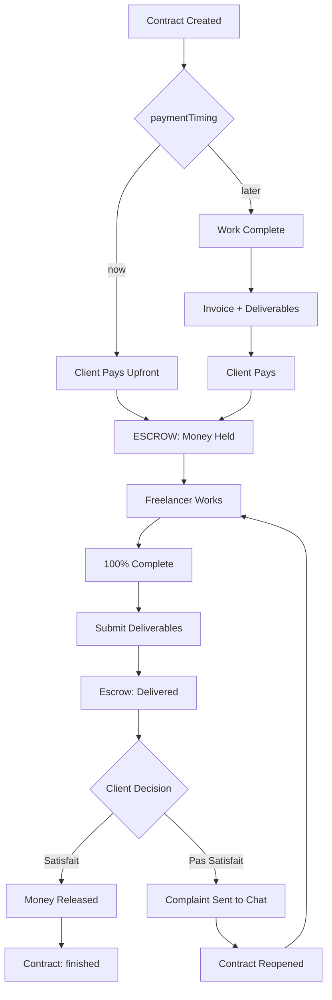

# Payment Flow Enhancement Plan

## Overview
Implement comprehensive payment flows with **escrow for ALL contracts**:

1. **"Pay Now" (Upfront with Escrow)**: Client pays → Money held → Freelancer works → Delivers → Client approves OR complains → Money released OR dispute
2. **"Pay Later" (Arrears with Escrow)**: Freelancer works → Creates invoice with deliverables → Client pays (money held) → Client approves OR complains → Money released OR dispute

**Key Principle**: Money is ALWAYS held in escrow until the client says they're satisfied.

## Payment Flow Types

### Flow A: "Pay Now" + Fixed Price (Escrow)
```
Client Pays → [ESCROW] → Freelancer Works → Freelancer Submits → 
Client:
  ├─ "Satisfait" → Money to Freelancer → Contract "finished"
  └─ "Pas Satisfait" → Complaint → Contract Reopens → Dispute
```

### Flow B: "Pay Now" + Hourly Rate (Escrow)
```
Client Pays (initial/estimated) → [ESCROW] → Freelancer Works → Track Hours →
Work Complete → Client Satisfait → Money Released
OR:
Work Complete → Client Pas Satisfait → Dispute → Contract Reopens
```

### Flow C: "Pay Later" (with Escrow)
```
Freelancer Works → Invoice + Deliverables → Client Pays (money held) →
Client reviews:
  ├─ Satisfait → Money Released → Contract "finished"
  └─ Pas Satisfait → Dispute → Contract Reopens
```

## Schema Changes

### Step 1: Add New Statuses and Fields
**File**: `convex/schema.ts`

```typescript
contracts: defineTable({
  // ... existing fields ...
  status: v.union(
    v.literal("pending"),
    v.literal("active"),
    v.literal("completed"),
    v.literal("declined"),
    v.literal("finished"),
    v.literal("disputed")     // NEW: When client complains
  ),
  paymentTiming: v.union(
    v.literal("now"),
    v.literal("later")
  ),
  escrowStatus: v.optional(v.union(    // NEW: For escrow tracking
    v.literal("held"),       // Money held, work not done
    v.literal("delivered"),  // Work delivered, awaiting approval
    v.literal("released"),   // Client approved, money released
    v.literal("refunded")    // Dispute, money refunded
  )),
  escrowPaidAt: v.optional(v.number()), // When client paid upfront
  escrowReleasedAt: v.optional(v.number()), // When money released to freelancer
}),
```

## Implementation Steps

### Step 2: Add Escrow Status Enum to TypeScript
**File**: `src/types/index.ts`

```typescript
export type EscrowStatus = "held" | "delivered" | "released" | "refunded";
```

### Step 3: Update simulatePayment for Escrow
**File**: `convex/invoices.ts`

When contract is "Pay Now" (Fixed OR Hourly) - ESCROW applies:
```typescript
export const simulatePayment = mutation({
  args: { invoiceId: v.id("invoices") }, // For "later" contracts
  // OR for "now" contracts:
  args: { contractId: v.id("contracts"), upfrontPayment: v.boolean() },
  
  handler: async (ctx, args) => {
    // For escrow contracts (all Pay Now contracts):
    if (contract.paymentTiming === "now") {
      // Money is held in escrow
      await ctx.db.patch(contract._id, {
        escrowStatus: "held",
        escrowPaidAt: Date.now(),
        status: "active", // Contract activated but money held
      });
      // Don't change contract to finished - wait for approval
    } else {
      // For "Pay Later" contracts: money is paid but HELD until satisfaction
      await ctx.db.patch(contract._id, {
        escrowStatus: "delivered", // Money held, awaiting client satisfaction
        status: "active",
      });
    }
  },
});
```

### Step 4: Create Freelancer Submit Completion Mutation
**File**: `convex/contracts.ts`

```typescript
export const submitCompletion = mutation({
  args: {
    contractId: v.id("contracts"),
    deliverables: v.array(v.object({
      name: v.string(),
      url: v.string(),
    })),
    notes: v.optional(v.string()),
  },
  handler: async (ctx, args) => {
    const userId = await getAuthUserId(ctx);
    if (!userId) throw new ConvexError("Not authenticated");

    const contract = await ctx.db.get("contracts", args.contractId);
    if (!contract) throw new ConvexError("Contract not found");
    if (contract.freelancerId !== userId) {
      throw new ConvexError("Not authorized");
    }
    if (contract.escrowStatus !== "held") {
      throw new ConvexError("Contract is not in escrow");
    }

    // Update deliverables and escrow status
    await ctx.db.patch(contract._id, {
      deliverables: args.deliverables,
      escrowStatus: "delivered",
      // Don't change status to finished - wait for client approval
    });

    // Notify client
    await ctx.scheduler.runAfter(0, internalAny.actions.push.sendWorkDeliveredNotification, {
      contractId: contract._id,
    });

    return null;
  },
});
```

### Step 5: Create Client Approval Mutation
**File**: `convex/contracts.ts`

```typescript
export const approveDelivery = mutation({
  args: { contractId: v.id("contracts") },
  handler: async (ctx, args) => {
    const userId = await getAuthUserId(ctx);
    if (!userId) throw new ConvexError("Not authenticated");

    const contract = await ctx.db.get("contracts", args.contractId);
    if (!contract) throw new ConvexError("Contract not found");
    if (contract.clientId !== userId) {
      throw new ConvexError("Not authorized");
    }
    if (contract.escrowStatus !== "delivered") {
      throw new ConvexError("No delivery to approve");
    }

    // Release escrow - money to freelancer
    await ctx.db.patch(contract._id, {
      status: "finished",
      escrowStatus: "released",
      escrowReleasedAt: Date.now(),
    });

    // Notify freelancer
    await ctx.scheduler.runAfter(0, internalAny.actions.push.sendPaymentReleasedNotification, {
      contractId: contract._id,
    });

    return null;
  },
});
```

### Step 6: Create Client Dispute Mutation
**File**: `convex/contracts.ts`

```typescript
export const disputeDelivery = mutation({
  args: {
    contractId: v.id("contracts"),
    complaint: v.string(),
  },
  handler: async (ctx, args) => {
    const userId = await getAuthUserId(ctx);
    if (!userId) throw new ConvexError("Not authenticated");

    const contract = await ctx.db.get("contracts", args.contractId);
    if (!contract) throw new ConvexError("Contract not found");
    if (contract.clientId !== userId) {
      throw new ConvexError("Not authorized");
    }
    if (contract.escrowStatus !== "delivered") {
      throw new ConvexError("No delivery to dispute");
    }

    // Reopen contract
    await ctx.db.patch(contract._id, {
      status: "active", // Reopen contract
      escrowStatus: "held", // Money still held
    });

    // Send complaint to chat
    const message = `Client not satisfied, here is his complain: ${args.complaint}`;
    await ctx.db.insert("messages", {
      contractId: contract._id,
      senderId: userId,
      content: message,
    });

    // Notify freelancer
    await ctx.scheduler.runAfter(0, internalAny.actions.push.sendDisputeNotification, {
      contractId: contract._id,
      complaint: args.complaint,
    });

    return null;
  },
});
```

### Step 7: Create Push Notification Actions
**File**: `convex/actions/push.ts`

```typescript
export const sendWorkDeliveredNotification = action({
  args: { contractId: v.id("contracts") },
  handler: async (ctx, args) => {
    // Get client info and push token
    // Send: "Your freelancer has submitted the work. Please review."
  },
});

export const sendPaymentReleasedNotification = action({
  args: { contractId: v.id("contracts") },
  handler: async (ctx, args) => {
    // Get freelancer info and push token
    // Send: "Your payment has been released! Client approved the work."
  },
});

export const sendDisputeNotification = action({
  args: { 
    contractId: v.id("contracts"),
    complaint: v.string(),
  },
  handler: async (ctx, args) => {
    // Get freelancer info and push token
    // Send: "Client has raised a dispute. Check your chat."
  },
});
```

## UI Changes

### Step 8: Update Client Contract Detail Screen
**File**: `app/(client)/contracts/[id]/index.tsx`

For escrow contracts with "delivered" status:
```typescript
{contract.escrowStatus === "delivered" && (
  <>
    <Typography variant="h3">Work Delivered!</Typography>
    <Typography variant="body">
      Your freelancer has submitted the work. Please review the deliverables.
    </Typography>
    
    {/* Show deliverables */}
    <DeliverableLinks deliverables={contract.deliverables} editable={false} />
    
    {/* Approval buttons */}
    <View style={styles.escrowButtons}>
      <Button 
        title="Pas satisfait du service" 
        variant="outline"
        onPress={() => setShowDisputeForm(true)}
      />
      <Button 
        title="Satisfait du service" 
        variant="primary"
        onPress={handleApprove}
      />
    </View>
    
    {/* Dispute form */}
    {showDisputeForm && (
      <View style={styles.disputeForm}>
        <Input
          label="Describe your issue"
          value={complaint}
          onChangeText={setComplaint}
          multiline
        />
        <Button title="Submit Complaint" onPress={handleDispute} />
      </View>
    )}
  </>
)}
```

### Step 9: Update Freelancer Contract Detail Screen
**File**: `app/(freelancer)/contracts/[id]/index.tsx`

Show completion button for escrow contracts:
```typescript
const showCompleteButton = 
  contract?.escrowStatus === "held" && 
  completionPercent === 100;
```

### Step 10: Create Completion Screen for Freelancer
**File**: `app/(freelancer)/contracts/[id]/complete.tsx`

```typescript
export default function CompleteContractScreen() {
  // Form with deliverables + notes
  // Submit calls submitCompletion mutation
}
```

## Email Templates

### For Escrow Release (to Freelancer)
**File**: `convex/email.ts`

```typescript
export const sendPaymentReleasedEmail = action({
  // Subject: "Payment Released! 🎉"
  // Content: "Client approved the work. Your payment has been released."
});
```

### For Dispute (to Freelancer)
**File**: `convex/email.ts`

```typescript
export const sendDisputeEmail = action({
  // Subject: "Client Raised a Dispute"
  // Content: "Client not satisfied. Check your chat for details."
});
```

## Files Summary

| File | Purpose |
|------|---------|
| `convex/schema.ts` | Add `disputed` status, `escrowStatus` field |
| `convex/contracts.ts` | Add `submitCompletion`, `approveDelivery`, `disputeDelivery` mutations |
| `convex/invoices.ts` | Update `simulatePayment` for escrow |
| `convex/actions/push.ts` | Add notification actions |
| `convex/email.ts` | Add email templates |
| `app/(client)/contracts/[id]/index.tsx` | Show approval/dispute buttons |
| `app/(freelancer)/contracts/[id]/index.tsx` | Show completion button |
| `app/(freelancer)/contracts/[id]/complete.tsx` | Completion form |

## Flow Diagram



## Testing Checklist

- [ ] Client pays upfront for fixed-price → money held in escrow
- [ ] Freelancer completes work → submits deliverables
- [ ] Client sees "Satisfait/Pas Satisfait" buttons
- [ ] Client clicks "Satisfait" → money released to freelancer
- [ ] Client clicks "Pas Satisfait" → complaint field appears
- [ ] Complaint sent to chat with template
- [ ] Contract reopens after dispute
- [ ] Push notifications sent at each step
- [ ] Emails sent at each step