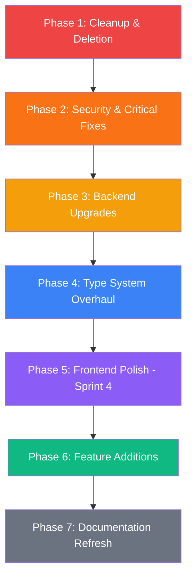

# FlowDesk — Project Improvement Master Plan

<!-- This is a backlog/backlog reference document. See docs/IMPLEMENTATION_ROADMAP.md for prioritized roadmap. -->

**Created:** 2026-04-12  
**Purpose:** Comprehensive plan to clean up, upgrade, and enhance FlowDesk across all layers  
**Execution Model:** Designed for orchestrator delegation — each phase has independent, self-contained tasks

---

## Plan Overview



### Execution Order & Dependencies

| Phase | Depends On | Can Run In Parallel With |
|---|---|---|
| Phase 1 — Cleanup | None | Phase 2 |
| Phase 2 — Security | None | Phase 1 |
| Phase 3 — Backend | Phase 2 | Phase 4 (partially) |
| Phase 4 — Types | Phase 3 | Phase 5 (partially) |
| Phase 5 — Frontend | Phase 3, Phase 4 | Phase 7 |
| Phase 6 — Features | Phase 3, Phase 4, Phase 5 | Phase 7 |
| Phase 7 — Docs | Phase 1 through Phase 6 | None (finalize last) |

---

## Phase 1: Cleanup & Deletion

**Agent type:** Code mode  
**Risk level:** Low  
**Goal:** Remove dead code, unused dependencies, and stale files

### Task 1.1 — Remove Unused npm Dependencies

**Files to modify:** `package.json`  
**Action:** Remove these unused packages and run `npm install`:

| Package | Reason for Removal |
|---|---|
| `clsx` | Not used. App uses React Native StyleSheet exclusively, no className merging |
| `expo-screen-orientation` | Not used. App locked to portrait in app.json, no orientation API calls |

After removal, run `npx expo start` to verify the app still builds cleanly.

**Verification:** App compiles without errors. No import references to removed packages.

---

### Task 1.2 — Evaluate `react-native-worklets` and `lightningcss` Resolution

**Files to modify:** `package.json`  
**Action:**
1. Check if `react-native-worklets` is a direct dependency or auto-resolved by `react-native-reanimated`. If Reanimated manages it, remove the explicit entry.
2. Remove the `"resolutions": { "lightningcss": "1.30.1" }` block — this was a workaround for NativeWind/Tailwind compatibility issues that no longer apply.
3. Run `npm install` and `npx expo start` to verify.

**Verification:** App compiles. No Metro bundler errors.

---

### Task 1.3 — Archive Completed Sprint Plans

**Files involved:** All files in `plans/`  
**Action:**
1. Create `plans/archive/` directory
2. Move these completed/historical plan files into `plans/archive/`:
   - `plans/sprint1-foundation-plan.md`
   - `plans/sprint2-plan.md`
3. Leave active/in-progress plans in `plans/`:
   - `plans/sprint3-plan.md`
   - `plans/sprint3-1-ui-logic-fix-plan.md`
   - `plans/sprint4-payment-earnings-plan.md`
4. Merge these 4 overlapping payment plan files into **one** canonical file called `plans/payment-flow-consolidated-plan.md`, then delete the originals:
   - `plans/payment-flow-enhancement-plan.md`
   - `plans/payment-flow-bugfixes-plan.md`
   - `plans/bugfix-fixed-price-payment-plan.md`
   - `plans/pay-now-payment-flow-fix.md`

**Verification:** `plans/` directory has only active plans. Archived files accessible in `plans/archive/`.

---

### Task 1.4 — Update `.env.example` to Match Reality

**File:** `.env.example`  
**Action:**
1. Remove `ANTHROPIC_API_KEY` reference (project switched to OpenRouter)
2. Add `OPENROUTER_API_KEY` with description
3. Add `EXPO_ACCESS_TOKEN` if push notifications use it (referenced in `convex/pushInternal.ts`)
4. Ensure all env vars used in `convex/` actions are listed

**Target content:**
```
# Convex Configuration
CONVEX_DEPLOYMENT=your-convex-deployment-url
EXPO_PUBLIC_CONVEX_URL=your-convex-url

# AI Configuration (OpenRouter)
OPENROUTER_API_KEY=your-openrouter-api-key

# Email Configuration (Resend)
RESEND_API_KEY=your-resend-api-key

# Push Notifications (Expo)
EXPO_ACCESS_TOKEN=your-expo-access-token
```

**Verification:** Every `process.env.XXX` used in `convex/` has a corresponding entry in `.env.example`.

---

## Phase 2: Security & Critical Fixes

**Agent type:** Code mode  
**Risk level:** High — these are security and data integrity issues  
**Goal:** Fix authorization gaps, unsafe patterns, and Convex anti-patterns

### Task 2.1 — Fix Invoice Authorization (Any User Can Read Any Invoice)

**File:** `convex/invoices.ts`  
**Problem:** `getByContract` and `getById` queries check that a user is authenticated but never verify the user is a party to the contract. Any logged-in user can query any invoice.

**Action:**
1. In `getByContract`: after fetching the invoice, get the contract, verify `userId === contract.freelancerId || userId === contract.clientId`
2. In `getById`: same check — get the linked contract, verify ownership
3. In `listByFreelancer`: already checks role — OK

**Pattern to apply:**
```typescript
const contract = await ctx.db.get(args.contractId);
if (!contract) return null;
if (contract.freelancerId !== userId && contract.clientId !== userId) return null;
```

**Verification:** Create a test user, try to query another user's invoice — should return `null`.

---

### Task 2.2 — Fix Task Authorization (Any User Can List Any Contract's Tasks)

**File:** `convex/tasks.ts`  
**Problem:** `list` query only checks auth, not contract access. Same for `create`, but `create` does check `contract.freelancerId`.

**Action:**
1. In `list`: fetch the contract, verify user is freelancer or client on that contract
2. Apply same pattern as Task 2.1

**Verification:** Non-party user gets empty array when querying tasks for a contract they don't belong to.

---

### Task 2.3 — Fix Message Authorization

**File:** `convex/messages.ts`  
**Problem:** `listByContract` only verifies contract exists, not that the caller is a party. `send` mutation may also lack checks.

**Action:**
1. In `listByContract`: verify `userId === contract.freelancerId || userId === contract.clientId`
2. In `send`: same. Only parties can send.
3. In `getUnreadCount` and `getUnreadCountsByContract`: same check

**Verification:** Non-party user cannot read or send messages to a contract.

---

### Task 2.4 — Fix Push Notification Architecture (Network I/O in Mutation)

**Files:** `convex/pushInternal.ts`, `convex/actions/push.ts`  
**Problem:** `pushInternal.ts` uses `internalMutation` but calls `fetch()` to Expo Push API. In Convex, mutations should NOT perform network I/O — that's what actions are for. This works today but violates Convex's determinism guarantees and could break on Convex runtime updates.

**Action:**
1. Convert `_sendPushToUser` from `internalMutation` to `internalAction`
2. Update `convex/actions/push.ts` to call the internal action (not mutation) via `ctx.runAction` or `ctx.scheduler.runAfter`
3. If the internal action needs to read push tokens from the DB, pass them as arguments or use `ctx.runQuery` inside the action

**New architecture:**
```
mutations → ctx.scheduler.runAfter(0, internalAction) → fetch Expo Push API
```

**Verification:** Push notifications still work. No `internalMutation` performs network calls.

---

### Task 2.5 — Remove `as any` Type Casts on Internal API

**Files:** `convex/contracts.ts`, `convex/ai.ts`, `convex/email.ts`, `convex/invoices.ts`, `convex/tasks.ts`, `convex/actions/push.ts`  
**Problem:** All these files use `const internalAny = internal as any;` which bypasses TypeScript safety.

**Action:**
1. Identify every call using `internalAny.xxx` or `apiAny.xxx`
2. Replace with properly typed `internal.xxx` references
3. If the generated types don't resolve (e.g. for `actions/push`), check that the Convex codegen is working correctly — `npx convex dev` should have generated proper types in `convex/_generated/api.ts`
4. If module path names with slashes cause issues (e.g. `internal.actions.push`), refer to Convex docs on how to reference nested modules

**Verification:** All `as any` casts removed. TypeScript compiles without errors. All Convex function calls are fully typed.

---

## Phase 3: Backend Upgrades

**Agent type:** Code mode  
**Risk level:** Medium  
**Goal:** Performance improvements, schema correctness, and pattern fixes

### Task 3.1 — Fix `getByEmail` Full Table Scan

**File:** `convex/users.ts`  
**Problem:** Line 60 does `ctx.db.query("users").collect()` then `.find()` — this loads every user into memory.

**Action:** 
Since `authTables` manages the `users` table and doesn't expose an email index, create a workaround:

**Option A (Preferred):** Add a `userEmails` lookup table:
```typescript
// In schema.ts
userEmails: defineTable({
  userId: v.id("users"),
  email: v.string(),
}).index("by_email", ["email"])
```
Populate it during registration (in `auth.ts` afterUserCreatedOrUpdated callback or in `setUserRole`), then query it in `getByEmail`.

**Option B (Simpler):** Use a search index on the users table:
```typescript
// In schema.ts, after ...authTables
// Note: Convex search indexes may not support exact match well — test first
```

**Verification:** `getByEmail` no longer does full table scan. Contract creation time does not increase with user count.

---

### Task 3.2 — Validate Notification Type Field

**File:** `convex/schema.ts`  
**Problem:** `notifications.type` is `v.string()` — any arbitrary string can be inserted.

**Action:** Change to:
```typescript
type: v.union(
  v.literal("contract_invite"),
  v.literal("contract_accepted"),
  v.literal("contract_declined"),
  v.literal("task_complete"),
  v.literal("invoice_received"),
  v.literal("payment_received"),
  v.literal("new_message"),
  v.literal("project_complete"),
  v.literal("deliverable_released")
),
```

Also update `convex/notifications.ts` `create` mutation args to use the same union instead of `v.string()`.

**Important:** Run `npx convex dev` after. Check that no existing notification documents have types outside this union — if they do, migrate them first or add the missing literals.

**Verification:** Schema validates notification types. Inserting an invalid type throws a validation error.

---

### Task 3.3 — Fix Notification Sorting (In-Memory → Database)

**File:** `convex/notifications.ts`  
**Problem:** `list` query collects all notifications then sorts with `.sort()` in JS. Should use Convex's `.order("desc")`.

**Action:** Replace:
```typescript
const notifications = await ctx.db
  .query("notifications")
  .withIndex("by_user", (q) => q.eq("userId", userId))
  .collect();
return notifications.sort((a, b) => bTime - aTime);
```
With:
```typescript
return await ctx.db
  .query("notifications")
  .withIndex("by_user", (q) => q.eq("userId", userId))
  .order("desc")
  .collect();
```

**Verification:** Notifications still displayed newest-first. No in-memory sort.

---

### Task 3.4 — Optimize Chat Unread Count

**File:** `convex/messages.ts`  
**Problem:** `getUnreadCount` collects all messages for a contract, loops through to count. `getUnreadCountsByContract` does this for every single contract the user has.

**Action:**
1. For `getUnreadCount`: instead of `.collect()` + loop, use creation time filtering:
   ```typescript
   // Get messages after lastReadAt where sender != current user
   const messages = await ctx.db
     .query("messages")
     .withIndex("by_contract", (q) => q.eq("contractId", args.contractId))
     .filter((q) => 
       q.and(
         q.gt(q.field("_creationTime"), lastReadAt),
         q.neq(q.field("senderId"), userId)
       )
     )
     .collect();
   return messages.length;
   ```
2. For `getUnreadCountsByContract`: consider caching unread counts or limiting to active contracts only

**Verification:** Unread badges still show correct counts. Query execution is faster.

---

### Task 3.5 — Add Task `hourlyRate` Back to Schema (Or Clean Up References)

**Files:** `convex/schema.ts`, `src/types/index.ts`, various frontend files  
**Problem:** The `tasks` table schema has no `hourlyRate` field, but the TypeScript type `Task` defines it, and contract logic may reference task-level hourly rates.

**Action:** Decide:
- **If hourly rate per task is a feature** (per PRD Task Management spec): add `hourlyRate: v.optional(v.number())` to the tasks table in schema.ts
- **If hourly rate is only at contract level**: remove `hourlyRate` from the `Task` type in `src/types/index.ts` and any UI that references it

**Verification:** Schema and types are aligned. No runtime errors.

---

## Phase 4: Type System Overhaul

**Agent type:** Code mode  
**Risk level:** Medium  
**Goal:** Eliminate schema-type drift and establish a single source of truth for types

### Task 4.1 — Audit and Sync `src/types/index.ts` With Schema

**Files:** `src/types/index.ts`, `convex/schema.ts`  
**Problem:** Multiple drift issues:

| Type Definition | Schema Reality | Fix Needed |
|---|---|---|
| `ContractStatus` = 4 values | Schema has 6: adds `"finished"`, `"disputed"` | Add missing statuses |
| `Task.hourlyRate` defined | Schema has no hourlyRate on tasks | Resolve per Task 3.5 |
| `Message.senderName` defined | Schema has no senderName | Remove from type |
| `Contract` missing `escrowStatus`, `escrowPaidAt`, `escrowReleasedAt` | Schema has them | Add to type |
| `Contract` missing `deliverables` array | Schema has it | Add to type |
| `Invoice` missing `deliverables` array | Schema has it | Add to type |

**Action:**
1. Go through every table in `convex/schema.ts`
2. For each field, ensure `src/types/index.ts` has a matching property
3. For union types (status, pricingType, etc.), ensure all literals match
4. Consider adding a comment block at the top: `// KEEP IN SYNC WITH convex/schema.ts`

**Verification:** No TypeScript errors. Types match schema exactly.

---

### Task 4.2 — Consider Migrating to Convex `Doc<>` Types

**Files:** All files importing from `src/types/index.ts`  
**Problem:** Maintaining manual types that duplicate the schema is error-prone.

**Action:** Evaluate whether hooks and components can use `Doc<"contracts">` from `convex/_generated/dataModel` instead of manual types. 

This may require:
1. Updating import paths throughout the app
2. Handling cases where the frontend type has extra computed fields (like `freelancerName`) that aren't in the raw doc — use intersection types or wrapper types

**Note:** This is an architectural decision. If too invasive, keep manual types but ensure Task 4.1 keeps them synced. If feasible, switch to `Doc<>` for the core entity types and keep custom types only for computed/enriched shapes.

**Verification:** TypeScript compiles. All component props and hook return types are correctly typed.

---

## Phase 5: Frontend Polish (Sprint 4)

**Agent type:** Frontend Specialist mode  
**Risk level:** Low-Medium  
**Goal:** Make every screen demo-ready with proper states

### Task 5.1 — Add Empty States to All List Screens

**Files to modify:**
- `app/(freelancer)/contracts/index.tsx`
- `app/(freelancer)/dashboard/index.tsx`
- `app/(freelancer)/notifications/index.tsx`
- `app/(client)/contracts/index.tsx`
- `app/(client)/dashboard/index.tsx`
- `app/(client)/notifications/index.tsx`

**Action:** For each screen, when the data array is empty, show a styled empty state component with:
- An icon or illustration
- A descriptive message (e.g., "No contracts yet")
- A CTA button where appropriate (e.g., "Create your first contract")

**Design system:** Use `colors`, `spacing`, `typography` from `src/constants/`. No hardcoded values. Use existing `Typography` and `Button` components.

**Verification:** Every list screen shows a meaningful empty state when there's no data.

---

### Task 5.2 — Add Loading States to All Data-Fetching Screens

**Files:** All screen files that use `useQuery` or custom hooks  
**Action:**
1. When data is `undefined` (Convex loading state), show an `ActivityIndicator` centered on screen
2. Consider creating a reusable `LoadingScreen` component in `src/components/ui/`
3. Apply to all screens using Convex queries

**Verification:** No screen flashes blank/white while data loads. Loading spinner visible on first load.

---

### Task 5.3 — Add Error Boundaries

**Files:** Create `src/components/ui/ErrorBoundary.tsx`, modify layout files  
**Action:**
1. Create a React error boundary component that:
   - Catches render errors
   - Shows a friendly error message
   - Has a "Retry" button that resets the error state
2. Wrap each major screen group with the boundary (in layout files)
3. For Convex query failures, add try/catch in hooks and expose error state

**Verification:** Runtime errors show a recovery UI instead of a white screen/crash.

---

### Task 5.4 — Wire Notification Deep Links

**Files:** `hooks/use-push-notifications.ts`, navigator layouts  
**Problem:** Notifications contain `contractId` but tapping them doesn't navigate to the right screen.

**Action:**
1. In the push notification handler, read the `data.contractId` from the notification
2. Determine user role (from `useAuth`)
3. Navigate to the appropriate contract detail screen:
   - Freelancer: `/(freelancer)/contracts/[id]`
   - Client: `/(client)/contracts/[id]`
4. Handle the case where the app was closed and opened via notification (cold start deep link)

**Verification:** Tapping a push notification opens the correct contract screen.

---

### Task 5.5 — Add Unread Badge to Tab Navigator

**Files:** `app/(freelancer)/_layout.tsx`, `app/(client)/_layout.tsx`  
**Problem:** `notifications.unreadCount` query exists but isn't displayed as a badge.

**Action:**
1. Import `useQuery(api.notifications.unreadCount)` in both layout files
2. Set `tabBarBadge` on the Notifications tab:
   ```typescript
   tabBarBadge: unreadCount > 0 ? unreadCount : undefined
   ```
3. Also consider adding chat unread indicators via `messages.getUnreadCountsByContract`

**Verification:** Red badge appears on Notifications tab when unread notifications exist.

---

### Task 5.6 — Create Reusable `Divider` and `LoadingScreen` UI Components

**Files to create:** `src/components/ui/divider.tsx`, `src/components/ui/loading-screen.tsx`  
**Action:**
1. `Divider`: Simple horizontal line using `View` with `borderBottom`, configurable color and spacing
2. `LoadingScreen`: Centered `ActivityIndicator` with optional message text
3. Export from `src/components/ui/index.ts`

**Verification:** Components render correctly, follow design system constants.

---

### Task 5.7 — Add Profile `pseudo` Editing Support

**Files:** `convex/users.ts`, `app/(freelancer)/profile/index.tsx`, `app/(client)/profile/index.tsx`  
**Problem:** `updateProfile` mutation only supports `name`. Users should also edit `pseudo` per the PRD.

**Action:**
1. Since `pseudo` isn't on the auth `users` table, decide storage:
   - **Option A:** Add a `userProfiles` table with `userId`, `pseudo`, `bio`, etc.
   - **Option B:** Store pseudo in `userRoles` table (rename to `userProfiles` and add fields)
2. Update `me` query to return `pseudo`
3. Update profile screens to show and edit `pseudo`

**Verification:** User can view and edit their pseudo/handle from the profile screen.

---

## Phase 6: Feature Additions

**Agent type:** Code mode (backend) + Frontend Specialist (UI)  
**Risk level:** Medium  
**Goal:** Add missing features from the PRD and improve the user experience

### Task 6.1 — Create Chat List Screens

**Files to create:** `app/(freelancer)/chat/index.tsx`, `app/(client)/chat/index.tsx`  
**Problem:** Users can only access chat from contract detail. No overview of all conversations.

**Action:**
1. Create a query `messages.getLatestByUser` that returns the last message per contract for the current user
2. Create the chat list screen showing all active contract chats with:
   - Contact name
   - Last message preview
   - Unread count badge
   - Timestamp
3. Tapping a chat navigates to the existing `chat/[contractId].tsx` screen
4. Ensure the chat tab in the navigator points to this index screen

**Verification:** Both freelancer and client can see a list of all their active conversations.

---

### Task 6.2 — Wire Contract Completion Flow

**Files:** `app/(freelancer)/contracts/[id]/index.tsx`, `app/(freelancer)/contracts/[id]/complete.tsx`  
**Problem:** `complete.tsx` exists but there's no clear entry point from the contract detail screen.

**Action:**
1. In the freelancer contract detail, when `completionPercent === 100`, show a prominent "Complete Project" or "Generate Invoice" CTA
2. Ensure navigation to `complete.tsx` or `invoice.tsx` works
3. Verify the flow: 100% → CTA visible → tap → invoice draft screen

**Verification:** Freelancer sees CTA at 100% and can navigate to the completion/invoice flow.

---

### Task 6.3 — Add Revenue Dashboard to Freelancer Home

**Files:** `convex/invoices.ts`, `hooks/useInvoice.ts`, `app/(freelancer)/dashboard/index.tsx`  
**Action:**
1. Implement `getFreelancerEarnings` query (as designed in `plans/sprint4-payment-earnings-plan.md`):
   - Sum totals from paid invoices linked to freelancer's contracts
   - Return `{ totalEarnings, paidInvoicesCount, pendingAmount }`
2. Create `useFreelancerEarnings` hook
3. Add an earnings card to the freelancer dashboard showing:
   - Total earned (formatted in XOF/USD)
   - Number of paid contracts
   - Pending earnings

**Verification:** Freelancer dashboard shows earnings summary. Values update when invoices are paid.

---

### Task 6.4 — Add Input Validation to Chat Messages

**File:** `convex/messages.ts`  
**Problem:** `send` mutation accepts any string with no length limit.

**Action:**
1. Add validation: content must be between 1 and 5000 characters
2. Trim whitespace before insert
3. Reject empty/whitespace-only messages

```typescript
args: {
  contractId: v.id("contracts"),
  content: v.string(), // Validate manually in handler
},
handler: async (ctx, args) => {
  const trimmed = args.content.trim();
  if (trimmed.length === 0) throw new ConvexError("Message cannot be empty");
  if (trimmed.length > 5000) throw new ConvexError("Message too long (max 5000 characters)");
  // ...
}
```

**Verification:** Empty messages rejected. Long messages rejected. Normal messages work.

---

### Task 6.5 — Add Rate Limiting to Critical Mutations (Optional)

**Files:** `package.json`, various Convex files  
**Action:**
1. Install `@convex-dev/ratelimiter`
2. Add rate limits to:
   - `contracts:create` — max 5 per minute per user
   - `messages:send` — max 30 per minute per user
   - AI invoice generation — max 3 per hour per user
3. Return user-friendly error messages when rate limited

**Verification:** Rapid-fire mutations are throttled. Normal usage unaffected.

---

## Phase 7: Documentation Refresh

**Agent type:** Documentation Specialist mode  
**Risk level:** Low  
**Goal:** Align all docs with the actual codebase

### Task 7.1 — Rewrite `docs/DATABASE_SCHEMA.md`

**Action:** Regenerate from the live `convex/schema.ts`. Include:
- All tables with correct field names and types
- Updated indexes
- Note that `users` table comes from `authTables` (fixed schema)
- Note the separate `userRoles`, `userPushTokens`, `chatReadStatus` tables
- Remove the fake `migrations/` directory reference

---

### Task 7.2 — Rewrite `docs/API_CONTRACT.md`

**Action:** Regenerate from the actual Convex function exports:
- Use actual function names (e.g., `contracts.list` not `contracts:listByFreelancer`)
- Document actual input/output shapes from the code
- Separate queries, mutations, and actions clearly

---

### Task 7.3 — Update `docs/README.md`

**Action:**
- Update the project structure tree to match actual file layout
- Fix the "Getting Started" section (mention OpenRouter, not just Anthropic)
- Add the correct environment variables
- Update the Tech Stack table

---

### Task 7.4 — Delete or Rewrite `docs/TECHNICAL_ROADMAP.md`

**Action:** This 500+ line doc has extensive code samples that no longer match reality. Either:
- Delete it (the sprint plans serve the same purpose)
- Or rewrite Section 2 (Type Definitions) and Section 3 (Function Signatures) to match actual code

---

### Task 7.5 — Update `docs/IMPLEMENTATION_ROADMAP.md`

**Action:**
- Mark Sprint 3 tasks that are actually done as ✅
- Update Sprint 4 task list to include the new tasks from this plan
- Add a Sprint 5 section for post-demo improvements if needed

---

### Task 7.6 — Archive or Delete `docs/IMPLEMENTATION_ROADMAP_STATUS.md`

**Action:** This file only covers Sprint 1 and is frozen. Either delete it or merge the "Key Fixes Applied" section into the main roadmap as a historical note.

---

## Orchestration Summary

Below is the delegatable task list for an orchestrator. Each task is independent within its phase.

### Phase 1 — Cleanup (4 tasks, can all run in parallel)
- [ ] Task 1.1 — Remove unused npm dependencies
- [ ] Task 1.2 — Evaluate worklets/lightningcss resolution
- [ ] Task 1.3 — Archive completed sprint plans
- [ ] Task 1.4 — Update .env.example

### Phase 2 — Security (5 tasks, can all run in parallel)
- [ ] Task 2.1 — Fix invoice authorization
- [ ] Task 2.2 — Fix task authorization
- [ ] Task 2.3 — Fix message authorization
- [ ] Task 2.4 — Fix push notification architecture
- [ ] Task 2.5 — Remove `as any` type casts

### Phase 3 — Backend (5 tasks, some parallel)
- [ ] Task 3.1 — Fix getByEmail full table scan
- [ ] Task 3.2 — Validate notification type field
- [ ] Task 3.3 — Fix notification sorting
- [ ] Task 3.4 — Optimize chat unread count
- [ ] Task 3.5 — Resolve task hourlyRate schema mismatch

### Phase 4 — Types (2 tasks, sequential)
- [ ] Task 4.1 — Sync types with schema
- [ ] Task 4.2 — Evaluate migration to Doc types (optional)

### Phase 5 — Frontend Polish (7 tasks, mostly parallel)
- [ ] Task 5.1 — Empty states for all list screens
- [ ] Task 5.2 — Loading states for all screens
- [ ] Task 5.3 — Error boundaries
- [ ] Task 5.4 — Notification deep links
- [ ] Task 5.5 — Unread badge on tab navigator
- [ ] Task 5.6 — Create Divider and LoadingScreen components
- [ ] Task 5.7 — Profile pseudo editing

### Phase 6 — Features (5 tasks)
- [ ] Task 6.1 — Chat list screens
- [ ] Task 6.2 — Wire contract completion flow
- [ ] Task 6.3 — Revenue dashboard
- [ ] Task 6.4 — Chat input validation
- [ ] Task 6.5 — Rate limiting (optional)

### Phase 7 — Docs (6 tasks, run after all code changes)
- [ ] Task 7.1 — Rewrite DATABASE_SCHEMA.md
- [ ] Task 7.2 — Rewrite API_CONTRACT.md
- [ ] Task 7.3 — Update README.md
- [ ] Task 7.4 — Delete or rewrite TECHNICAL_ROADMAP.md
- [ ] Task 7.5 — Update IMPLEMENTATION_ROADMAP.md
- [ ] Task 7.6 — Archive IMPLEMENTATION_ROADMAP_STATUS.md

**Total: 34 tasks across 7 phases**
