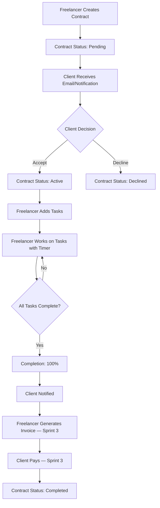

# Sprint 2 User Flows — FlowDesk

**Version:** 1.0  
**Created:** 2026-04-06  
**Purpose:** Detailed user flows showing how freelancers and clients interact with contracts, tasks, and chat

---

## Overview

This document explains the end-to-end user flows for Sprint 2, showing exactly how the frontend screens connect to the backend Convex functions.

---

## Flow 1: Freelancer Creates Contract → Client Receives & Accepts

### Step 1: Freelancer Creates Contract

**Screen:** [`app/(freelancer)/contracts/new.tsx`](app/(freelancer)/contracts/new.tsx)

1. Freelancer taps **"+ New Contract"** button on contracts list
2. Form appears with fields:
   - Client Email *(required)*
   - Client Name *(required)*
   - Client Pseudo/Username *(required)*
   - Project Title *(required)*
   - Pricing Type *(fixed or hourly)*
   - Fixed Price *(if pricing type is fixed)*
   - Payment Timing *(now or later)*
   - Payment Method *(Stripe, NabooPay Orange, NabooPay Wave)*
   - AI Email Tone *(formal, friendly, casual)*

3. Freelancer fills form and taps **"Create Contract"**

**What Happens:**

```typescript
// Frontend calls:
const { createContract } = useCreateContract();
await createContract({
  clientEmail: "john@example.com",
  clientName: "John Doe",
  clientPseudo: "johnd",
  title: "Website Redesign",
  pricingType: "fixed",
  fixedPrice: 2000,
  paymentTiming: "later",
  paymentMethod: "stripe",
  aiEmailTone: "friendly",
});

// Backend (convex/contracts.ts) creates contract with status: "pending"
// Contract is linked to freelancer via freelancerId
// clientId is null because client hasn't registered yet
// TODO Sprint 3: AI generates outreach email and sends via Resend
```

**Result:**
- Contract appears in freelancer's contract list with status **"Pending"**
- Client receives email with invitation link (Sprint 3)

---

### Step 2: Client Registers or Logs In

**Scenario A: Client Already Has Account**

1. Client logs in
2. Sees notification: "Someone wants to work with you"
3. Taps notification → Goes to contract detail screen

**Scenario B: Client Doesn't Have Account Yet**

1. Client receives email (Sprint 3)
2. Clicks link in email → Opens app (deep link)
3. Registration screen appears with pre-filled email
4. Client completes registration with password + role selection (client)
5. After registration, app redirects to contract detail

**What Happens:**

```typescript
// When client first registers with email matching clientEmail:
// Backend automatically links contract to client via email match
// contract.clientId is updated to the newly registered client's userId
```

---

### Step 3: Client Views Pending Contract

**Screen:** [`app/(client)/dashboard/index.tsx`](app/(client)/dashboard/index.tsx)

1. Client sees **"Pending Contracts"** section on dashboard
2. Contract appears with:
   - Project title
   - Freelancer name (from contract.freelancerId lookup)
   - Pricing type (fixed or hourly)
   - Status badge: **"Pending"**

**What Happens:**

```typescript
// Frontend:
const { contracts } = useClientContracts();
// Calls convex/contracts.ts → listByClient()
// Returns all contracts where clientId === current user
// Filters to show status === "pending" first
```

---

### Step 4: Client Accepts Contract

**Screen:** [`app/(client)/contracts/[id]/index.tsx`](app/(client)/contracts/[id]/index.tsx)

1. Client taps on pending contract
2. Contract detail screen shows:
   - Project title
   - Freelancer name
   - Pricing details
   - Payment method
   - **Accept** and **Decline** buttons

3. Client taps **"Accept"**

**What Happens:**

```typescript
// Frontend:
const { acceptContract } = useAcceptContract();
await acceptContract({ contractId });

// Backend (convex/contracts.ts):
// 1. Updates contract status to "active"
// 2. Creates notification for freelancer
// 3. TODO Sprint 3: Sends email to both parties
// 4. TODO Sprint 3: Sends push notification to freelancer
```

**Result:**
- Contract status changes to **"Active"**
- Freelancer receives notification: "John Doe accepted your contract 'Website Redesign'"
- Contract appears in **"Active Contracts"** section for both parties
- Freelancer can now add tasks

---

## Flow 2: Freelancer Adds Tasks & Uses Timer

### Step 1: Freelancer Navigates to Tasks Screen

**Screen:** [`app/(freelancer)/contracts/[id]/index.tsx`](app/(freelancer)/contracts/[id]/index.tsx)

1. Freelancer taps on active contract
2. Contract detail shows **"Tasks"** tab
3. Taps **"Manage Tasks"** button

**Screen:** [`app/(freelancer)/contracts/[id]/tasks.tsx`](app/(freelancer)/contracts/[id]/tasks.tsx)

---

### Step 2: Freelancer Creates Task

1. Taps **"+ Add Task"** button
2. Form appears:
   - Task Title *(required)*
   - Hourly Rate *(optional, only shown if contract is hourly pricing)*

3. Taps **"Create"**

**What Happens:**

```typescript
// Frontend:
const { createTask } = useCreateTask();
await createTask({
  contractId,
  title: "Design Homepage Mockup",
  hourlyRate: 50, // Only if hourly contract
});

// Backend (convex/tasks.ts):
// Creates task with status: "pending"
// Links to contract via contractId
```

**Result:**
- Task appears in task list with status **"Pending"**
- Completion bar shows 0% (no tasks completed yet)

---

### Step 3: Freelancer Starts Timer

1. Freelancer taps **"Start"** button on task
2. Task card shows:
   - Status changes to **"Running"**
   - Timer starts counting (HH:MM:SS format)
   - **Stop** button appears

**What Happens:**

```typescript
// Frontend:
const { startTimer } = useStartTimer();
await startTimer({ taskId });

// Backend (convex/tasks.ts):
// Records startedAt: Date.now()
// Updates status to "running"
```

**UI Updates:**
- Timer ticks every second in UI (local state)
- Timer persists even if app is backgrounded (startedAt stored in DB)

---

### Step 4: Freelancer Stops Timer

1. Freelancer finishes task
2. Taps **"Stop"** button
3. Task card shows:
   - Status changes to **"Completed"**
   - Timer stops
   - Shows total time spent (e.g., "2h 35m")
   - Checkmark icon appears

**What Happens:**

```typescript
// Frontend:
const { stopTimer } = useStopTimer();
await stopTimer({ taskId });

// Backend (convex/tasks.ts):
// 1. Records completedAt: Date.now()
// 2. Calculates timeSpent = (completedAt - startedAt) / 60000 (in minutes)
// 3. Updates status to "completed"
// 4. Triggers updateCompletionPercent (internal mutation)

// Internal mutation (convex/contracts.ts):
// 1. Counts all tasks
// 2. Counts completed tasks
// 3. Updates contract.completionPercent = (completed / total) * 100
// 4. If 100%, creates notification for client
```

**Result:**
- Task marked complete
- Completion bar updates in real time (e.g., "1 of 3 tasks complete — 33%")
- If 100% complete: Client receives notification "Project 'Website Redesign' is 100% complete!"

---

### Step 5: Client Sees Task Progress (Real-time)

**Screen:** [`app/(client)/contracts/[id]/index.tsx`](app/(client)/contracts/[id]/index.tsx)

1. Client opens contract detail
2. Sees **"Tasks"** tab
3. Task list shows:
   - All tasks with current status
   - Completion bar (real-time updates)
   - Time spent per task (if timer was used)

**What Happens:**

```typescript
// Frontend:
const { tasks } = useTasks(contractId);
// Calls convex/tasks.ts → listByContract()
// Returns all tasks for this contract
// Client can view but cannot edit (freelancer-only actions)
```

**Real-time Sync:**
- When freelancer completes a task, client's screen updates automatically
- Completion bar updates in real time
- No page refresh needed (Convex live query)

---

## Flow 3: Real-time Chat Between Freelancer & Client

### Step 1: Freelancer Opens Chat

**Screen:** [`app/(freelancer)/chat/[contractId].tsx`](app/(freelancer)/chat/[contractId].tsx)

1. Freelancer taps **"Chat"** button on contract detail
2. Chat screen shows:
   - Message list (scrollable)
   - Message input box at bottom
   - Send button

---

### Step 2: Freelancer Sends Message

1. Freelancer types: "Hey John, I've started working on the homepage mockup."
2. Taps **"Send"**

**What Happens:**

```typescript
// Frontend:
const { sendMessage } = useSendMessage();
await sendMessage({
  contractId,
  content: "Hey John, I've started working on the homepage mockup.",
});

// Backend (convex/messages.ts):
// 1. Creates message with senderId = freelancer userId
// 2. Links to contract via contractId
// 3. TODO Sprint 3: Creates notification for client
```

**Result:**
- Message appears in chat instantly
- Message bubble shows sender name + timestamp
- Message is stored in database

---

### Step 3: Client Receives Message (Real-time)

**Screen:** [`app/(client)/chat/[contractId].tsx`](app/(client)/chat/[contractId].tsx)

1. If client is in chat screen, message appears instantly (no refresh needed)
2. If client is elsewhere, notification appears:
   - Notification badge on "Notifications" tab
   - Push notification (Sprint 3)

**What Happens:**

```typescript
// Frontend:
const { messages } = useMessages(contractId);
// Calls convex/messages.ts → listByContract() (paginated)
// Returns messages ordered by createdAt DESC (newest first)
// Real-time subscription updates automatically when new message arrives
```

---

### Step 4: Client Replies

1. Client types: "Great! Can't wait to see it."
2. Taps **"Send"**

**What Happens:**

```typescript
// Same as freelancer flow
// Message appears instantly for freelancer (real-time)
```

**Chat Features:**
- Both parties can send and receive messages
- Message bubbles differentiated by sender (left/right alignment)
- Messages load more on scroll (paginated)
- Real-time updates (no polling, no refresh button)

---

## Flow 4: Notification System

### Types of Notifications:

| Event | Notification Type | Recipient | Message |
|---|---|---|---|
| Contract created | `contract_invite` | Client | "Someone wants to work with you" |
| Contract accepted | `contract_accepted` | Freelancer | "[Client] accepted your contract '[Title]'" |
| Contract declined | `contract_declined` | Freelancer | "[Client] declined your contract '[Title]'" |
| Project 100% complete | `task_complete` | Client | "Project '[Title]' is 100% complete!" |
| New message | `new_message` | Other party | "New message in '[Title]'" *(Sprint 3)* |
| Invoice received | `invoice_received` | Client | "Invoice ready for '[Title]'" *(Sprint 3)* |
| Payment received | `payment_received` | Freelancer | "Payment received for '[Title]'" *(Sprint 3)* |

---

### Notification Flow:

**Screen:** [`app/(freelancer)/notifications/index.tsx`](app/(freelancer)/notifications/index.tsx) or [`app/(client)/notifications/index.tsx`](app/(client)/notifications/index.tsx)

1. User taps **"Notifications"** tab in drawer navigator
2. Notification list shows:
   - Notification message
   - Timestamp
   - Unread badge (blue dot)
   - Contract link (if applicable)

3. User taps notification
4. If `contractId` is present: Navigate to contract detail
5. Notification marked as read

**What Happens:**

```typescript
// Frontend:
const { notifications } = useNotifications();
// Calls convex/notifications.ts → listByUser()
// Returns all notifications for current user, ordered by date DESC

const { markRead } = useMarkRead();
// When notification tapped:
await markRead({ notificationId });
// Updates notification.read = true in database
```

**Unread Badge:**

```typescript
const unreadCount = useUnreadCount();
// Calculates: notifications.filter(n => !n.read).length
// Displays as badge on "Notifications" tab icon
```

---

## Key Frontend Files to Implement:

### Freelancer Screens:

1. [`app/(freelancer)/contracts/new.tsx`](app/(freelancer)/contracts/new.tsx) — Create contract form
2. [`app/(freelancer)/contracts/[id]/index.tsx`](app/(freelancer)/contracts/[id]/index.tsx) — Contract detail
3. [`app/(freelancer)/contracts/[id]/tasks.tsx`](app/(freelancer)/contracts/[id]/tasks.tsx) — Task management
4. [`app/(freelancer)/chat/[contractId].tsx`](app/(freelancer)/chat/[contractId].tsx) — Chat screen

### Client Screens:

1. [`app/(client)/contracts/[id]/index.tsx`](app/(client)/contracts/[id]/index.tsx) — Contract detail + accept/decline
2. [`app/(client)/chat/[contractId].tsx`](app/(client)/chat/[contractId].tsx) — Chat screen

### Shared:

- [`app/(freelancer)/notifications/index.tsx`](app/(freelancer)/notifications/index.tsx)
- [`app/(client)/notifications/index.tsx`](app/(client)/notifications/index.tsx)

---

## Real-time Synchronization

All screens use Convex `useQuery` hooks, which provide **automatic real-time updates**:

- **Freelancer** completes a task → **Client's** completion bar updates instantly
- **Client** accepts contract → **Freelancer's** contract status updates instantly
- **Either party** sends a message → **Other party's** chat screen updates instantly
- **Any notification** is created → **Recipient's** notification list updates instantly

**No manual refresh needed. No polling. No websocket setup. Convex handles it all.**

---

## Deep Link Navigation (Sprint 3)

When a notification is tapped:

```typescript
// Check if notification has contractId
if (notification.contractId) {
  // Navigate to contract detail
  router.push(`/(${userRole})/contracts/${notification.contractId}`);
}

// Mark notification as read
await markRead({ notificationId: notification._id });
```

---

## Offline Behavior (Sprint 2 — Optional SQLite Caching)

**Online:** All data syncs in real time via Convex  
**Offline:** Last cached data available from SQLite (read-only)  
**Back Online:** Convex auto-syncs, SQLite cache updates

---

## Summary: Contract Lifecycle



---

## Next Implementation Steps:

1. ✅ Backend (Phase 1) — **DONE**
2. 🔄 Frontend (Phase 2-5):
   - Implement hooks (use-contracts, use-tasks, use-messages, use-notifications)
   - Build UI components (ContractCard, TaskCard, MessageBubble, etc.)
   - Wire up screens
   - Test end-to-end flow with two test accounts

---

**End of Sprint 2 User Flows**
