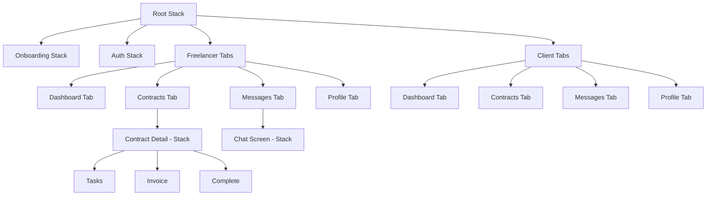
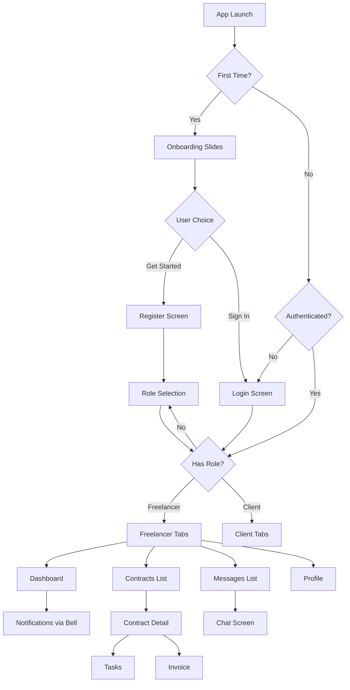

# FlowDesk UI/UX Complete Overhaul Plan

**Date:** 2026-04-13  
**Status:** ✅ Complete  
**Scope:** Frontend-only (no backend changes)

---

## Executive Summary

This plan transforms FlowDesk from its current state (Drawer navigation, emoji icons, iOS-blue palette, no landing page) into a polished, professional mobile app with:

1. **Multi-slide onboarding/welcome page** for first-time users
2. **Professional/neutral color palette** replacing the iOS-blue scheme
3. **Bottom Tab navigation** (4 tabs) replacing the Drawer
4. **Lucide React Native icons** replacing all emoji icons
5. **Dedicated Messages page** (conversation list) replacing the drawer dropdown
6. **Notification bell in header** instead of a dedicated tab
7. **Component cleanup** — fixing all 35+ UI issues from the prior diagnosis

---

## Decisions Made

| Decision | Choice |
|----------|--------|
| Icon library | `lucide-react-native` |
| Color direction | Professional/neutral palette |
| Navigation model | Bottom Tabs (4 tabs) |
| Tab structure | Dashboard, Contracts, Messages, Profile |
| Notifications | Bell icon in header (not a tab) |
| Landing page | Multi-slide onboarding/welcome |
| Styling approach | `StyleSheet.create()` only (no Tailwind) |
| Backend changes | None |

---

## Phase 1: Foundation — Dependencies, Color System, Icon System

### 1.1 Install Dependencies

```bash
npm install lucide-react-native react-native-svg
```

> `lucide-react-native` requires `react-native-svg` as a peer dependency.  
> `react-native-svg` may already be available through Expo — verify.

### 1.2 New Color Palette

Replace the current iOS-blue palette in `src/constants/colors.ts` with a professional/neutral scheme:

```
Current                    →  New (Professional Neutral)
─────────────────────────────────────────────────────
primary: #007AFF (iOS blue) →  #1E293B (Slate 800 — deep, professional)
primaryLight: #4DA3FF       →  #475569 (Slate 600)
primaryDark: #0055CC        →  #0F172A (Slate 900)
secondary: #5856D6          →  #6366F1 (Indigo 500 — accent)

success: #34C759            →  #10B981 (Emerald 500 — refined)
warning: #FF9500            →  #F59E0B (Amber 500)
error: #FF3B30              →  #EF4444 (Red 500)

freelancer: #10B981         →  #10B981 (keep — already good)
client: #8B5CF6             →  #8B5CF6 (keep — already good)

gray50-900                  →  Slate scale (more blue-tinted neutral)
  gray50:  #F8FAFC
  gray100: #F1F5F9
  gray200: #E2E8F0
  gray300: #CBD5E1
  gray400: #94A3B8
  gray500: #64748B
  gray600: #475569
  gray700: #334155
  gray800: #1E293B
  gray900: #0F172A

accent: (NEW)               →  #6366F1 (Indigo — for CTAs and highlights)
accentLight: (NEW)          →  #6366F120 (12% opacity)
```

**Rationale:** Slate tones feel premium and professional. The indigo accent adds visual interest to important CTAs. Freelancer green and client purple remain recognizable role markers.

### 1.3 Icon System Component

Create `src/components/ui/icon.tsx` — a thin wrapper around Lucide icons:

```typescript
// Standardized sizes, colors, props
// Maps icon names to Lucide components
// Provides consistent sizing: sm(16), md(20), lg(24), xl(32)
```

**Icons to map (for all current emoji replacements):**

| Current Emoji | Lucide Icon | Usage |
|---------------|-------------|-------|
| 🏠 | `Home` | Dashboard |
| 📄 | `FileText` | Contracts |
| 📋 | `ClipboardList` | Contract item |
| 💬 | `MessageCircle` | Chat/Messages |
| 🔔 | `Bell` | Notifications |
| 👤 | `User` | Profile |
| 💰 | `DollarSign` / `Wallet` | Earnings |
| ⚙️ | `Settings` | Settings |
| 📝 | `PenLine` | Create/Edit |
| ✓ | `Check` | Checkmark |
| + | `Plus` | Add new |
| 🤝 | `Handshake` | Client contracts |
| 🔍 | `Search` | Search |

### 1.4 Files Changed in Phase 1

| File | Action |
|------|--------|
| `package.json` | Add `lucide-react-native`, `react-native-svg` |
| `src/constants/colors.ts` | Complete palette replacement |
| `src/components/ui/icon.tsx` | **NEW** — Icon wrapper component |
| `src/components/ui/index.ts` | Export new Icon component |

---

## Phase 2: Multi-Slide Onboarding/Welcome Page

### 2.1 New Files

Create an onboarding flow that unauthenticated users see on first launch:

```
app/
├── (onboarding)/
│   ├── _layout.tsx          # Stack layout, no header
│   └── welcome.tsx          # Multi-slide welcome screen
```

### 2.2 Welcome Screen Design

**3 slides** with smooth horizontal pagination:

| Slide | Title | Description | Visual |
|-------|-------|-------------|--------|
| 1 | "Manage Your Freelance Business" | "Create contracts, track tasks, and invoice clients — all from your phone." | Contract illustration (icon-based) |
| 2 | "Real-Time Communication" | "Chat with clients per project. Stay aligned with contextual conversations." | Chat illustration (icon-based) |
| 3 | "Get Paid Faster" | "AI-generated invoices. Mobile money support. Professional delivery." | Invoice/payment illustration (icon-based) |

**Bottom section:** 
- Dot indicators for current slide
- "Get Started" button → navigates to Register
- "Already have an account? Sign in" link → navigates to Login

**Implementation:** Use `FlatList` with `pagingEnabled`, `horizontal`, and `onViewableItemsChanged` for slide tracking. No external carousel library needed.

### 2.3 Routing Change

Update `app/index.tsx`:
- Currently redirects unauthenticated users to `/(auth)/login`
- New: redirect to `/(onboarding)/welcome` for first launch (check AsyncStorage flag)
- Subsequent launches: redirect to `/(auth)/login` if `hasSeenOnboarding` is true

### 2.4 Files Changed in Phase 2

| File | Action |
|------|--------|
| `app/(onboarding)/_layout.tsx` | **NEW** — Onboarding stack layout |
| `app/(onboarding)/welcome.tsx` | **NEW** — Multi-slide welcome screen |
| `app/index.tsx` | Update redirect logic |
| `lib/storage.ts` | Add `hasSeenOnboarding` getter/setter |
| `src/constants/routes.ts` | Add onboarding routes |

---

## Phase 3: Navigation Overhaul — Drawer → Bottom Tabs

### 3.1 Architecture Change



### 3.2 Tab Bar Design

4 tabs with Lucide icons:

| Tab | Label | Icon | Active Color |
|-----|-------|------|-------------|
| Dashboard | Dashboard | `LayoutDashboard` | primary (slate) |
| Contracts | Contracts | `FileText` | primary |
| Messages | Messages | `MessageCircle` | primary + badge for unread |
| Profile | Profile | `User` | primary |

**Tab bar style:**
- Background: `colors.white`
- Border top: subtle `colors.gray200`
- Active icon: `colors.gray900` (filled)
- Inactive icon: `colors.gray400`
- Labels: shown, small (`12px`)
- Height: 60px (comfortable touch target)

### 3.3 Header Bar Design

Every screen gets a consistent header with:
- **Left:** Back arrow (on detail screens) or Screen title (on tab screens)
- **Right:** Notification bell icon with unread badge + optional action buttons

**Header component:** Create `src/components/ui/header-bar.tsx`
- Title prop
- `showNotificationBell` prop (default: true)
- `rightActions` prop for additional buttons (e.g., "+" on Contracts tab)
- Notification bell navigates to `/notifications`

### 3.4 New Messages List Screen

Create a **conversation list** screen for the Messages tab:

```
app/(freelancer)/messages/index.tsx
app/(client)/messages/index.tsx
```

**Design:**
- Each row shows: Avatar (initials), Contract title, last message preview, timestamp, unread badge
- Tapping a row opens `chat/[contractId]`
- Empty state: "No conversations yet. Start by creating a contract."
- Search bar at top for filtering conversations

**Data source:** Uses existing `useContracts()` hook + `useMessages()` for last message per contract.

### 3.5 Layout File Changes

**`app/(freelancer)/_layout.tsx`** — Complete rewrite:
- Replace `import { Drawer } from "expo-router/drawer"` with `import { Tabs } from "expo-router/tabs"`
- Define 4 visible tabs + hidden screens (`href: null`)
- Add Lucide icons per tab
- Auth guard remains unchanged

**`app/(client)/_layout.tsx`** — Same treatment.

### 3.6 Screens to Hide from Tab Bar

These screens exist as routes but should NOT show as tabs:

| Screen | Reason |
|--------|--------|
| `contracts/new` | Navigated to from Contracts tab |
| `contracts/[id]/index` | Contract detail |
| `contracts/[id]/tasks` | Tasks sub-screen |
| `contracts/[id]/invoice` | Invoice sub-screen |
| `contracts/[id]/complete` | Completion sub-screen |
| `chat/[contractId]` | Individual chat (from Messages) |
| `notifications/index` | Accessed via header bell |
| `notifications/preferences` | Accessed from notifications |
| `invoices/index` | Accessed from dashboard or contracts |

### 3.7 Files Changed in Phase 3

| File | Action |
|------|--------|
| `app/(freelancer)/_layout.tsx` | **REWRITE** — Drawer → Tabs |
| `app/(client)/_layout.tsx` | **REWRITE** — Drawer → Tabs |
| `app/(freelancer)/messages/index.tsx` | **NEW** — Messages list screen |
| `app/(client)/messages/index.tsx` | **NEW** — Messages list screen |
| `src/components/ui/header-bar.tsx` | **NEW** — Shared header with bell |
| `src/components/drawer/DrawerContent.tsx` | **DELETE** — No longer needed |
| `src/components/drawer/index.ts` | **DELETE** — No longer needed |
| `src/constants/routes.ts` | Add messages routes |
| `hooks/useMessages.ts` | Add `useConversationList()` hook or extend |

---

## Phase 4: Auth Screens Polish

### 4.1 Login Screen Upgrade

- Add FlowDesk logo/brand mark at top
- Update all colors to new palette
- Replace raw buttons with updated Button component
- Improve spacing and visual hierarchy
- Add subtle background pattern or gradient

### 4.2 Register Screen Upgrade

- Same visual treatment as login
- Add step indicators or visual flow cues

### 4.3 Role Selection Screen Upgrade

- Replace letter icons ("F" / "C") with Lucide icons (`Briefcase` for freelancer, `Building2` for client)
- Update colors to new palette
- Add subtle illustrations/icons for each role

### 4.4 Files Changed in Phase 4

| File | Action |
|------|--------|
| `app/(auth)/login.tsx` | Upgrade visuals |
| `app/(auth)/register.tsx` | Upgrade visuals |
| `app/(auth)/role-select.tsx` | Upgrade visuals, replace letter icons |
| `app/(auth)/_layout.tsx` | Update header styles |

---

## Phase 5: Dashboard Screens Enhancement

### 5.1 Freelancer Dashboard

- Update stat cards with Lucide icons
- Replace raw `Text` with `Typography`
- Use new color palette throughout
- Update progress bar styling
- Add notification bell in header
- Improve empty state with icon instead of "+"
- Add quick action buttons (New Contract, View All)

### 5.2 Client Dashboard

- Same treatment as freelancer
- Update "Active Projects" → "Active Contracts" (terminology fix)
- Update stat card icons

### 5.3 Files Changed in Phase 5

| File | Action |
|------|--------|
| `app/(freelancer)/dashboard/index.tsx` | Visual overhaul |
| `app/(client)/dashboard/index.tsx` | Visual overhaul |

---

## Phase 6: Contract & Chat Screens Enhancement

### 6.1 Contract List Screens

- Update filter chips with new colors
- Replace emoji in empty states with Lucide icons
- Update text to use Typography throughout
- Add FAB (floating action button) for new contract on freelancer side

### 6.2 Contract Detail Screens

- Update cards, status badges with new colors
- Replace all inline status badges with the `StatusBadge` component
- Replace raw Text with Typography

### 6.3 Chat Screens

- Update `ChatBubble` — replace emoji avatars with `Avatar` component
- Update `ChatInput` styling
- Update `ChatList` empty state

### 6.4 Files Changed in Phase 6

| File | Action |
|------|--------|
| `app/(freelancer)/contracts/index.tsx` | Visual update |
| `app/(client)/contracts/index.tsx` | Visual update |
| `app/(freelancer)/contracts/[id]/index.tsx` | Visual update |
| `app/(client)/contracts/[id]/index.tsx` | Visual update |
| `app/(freelancer)/contracts/[id]/tasks.tsx` | Visual update |
| `app/(freelancer)/contracts/[id]/invoice.tsx` | Visual update |
| `app/(client)/contracts/[id]/invoice.tsx` | Visual update |
| `app/(freelancer)/contracts/[id]/complete.tsx` | Visual update |
| `src/components/contracts/ContractCard.tsx` | Update colors/icons |
| `src/components/contracts/contracts-list.tsx` | Update colors/icons |
| `src/components/chat/ChatBubble.tsx` | Replace emoji with Avatar |
| `src/components/chat/ChatInput.tsx` | Visual update |
| `src/components/chat/ChatList.tsx` | Update empty state |

---

## Phase 7: Component System Cleanup

### 7.1 Fix Badge Component

- Replace hardcoded hex colors with design system `colors.*`
- Ensure all variants use semantic light variants

### 7.2 Replace All Raw `Text` with `Typography`

Fix 12+ files that import `Text` from `react-native` directly.

### 7.3 Fix Empty State Components

- Update `EmptyState` component to use Lucide icons instead of emoji
- Standardize empty state pattern across all screens

### 7.4 Notification Components

- Replace emoji notification type icons in `NotificationItem.tsx` with Lucide icons
- Update notification screen colors

### 7.5 Task Components

- Update `TaskItem` inline status colors to use design system
- Update `CompletionBar` to use Typography
- Update `TimerControl` styling

### 7.6 Invoice Components

- Update `InvoiceLineItems`, `InvoiceSummary`, `PaymentSimulation` with new colors
- Replace inline status badges with component

### 7.7 Files Changed in Phase 7

| File | Action |
|------|--------|
| `src/components/ui/badge.tsx` | Fix hardcoded colors |
| `src/components/ui/status-badge.tsx` | Update colors |
| `src/components/ui/empty-state.tsx` | Add icon prop, update styling |
| `src/components/ui/card.tsx` | Update colors |
| `src/components/ui/loading-button.tsx` | Update colors |
| `src/components/notifications/NotificationItem.tsx` | Replace emoji with icons |
| `src/components/notifications/NotificationList.tsx` | Visual update |
| `src/components/notifications/notification-screen.tsx` | Visual update |
| `src/components/tasks/TaskItem.tsx` | Update inline styles |
| `src/components/tasks/CompletionBar.tsx` | Use Typography |
| `src/components/tasks/TimerControl.tsx` | Visual update |
| `src/components/invoice/InvoiceLineItems.tsx` | Update colors |
| `src/components/invoice/InvoiceSummary.tsx` | Update colors |
| `src/components/invoice/PaymentSimulation.tsx` | Update colors |

---

## Phase 8: Profile & Settings Screens

### 8.1 Profile Screen

- Update avatar colors to new palette
- Add Lucide icons for field labels
- Update button styling

### 8.2 Notification Screens

- Update notification list icon
- Update notification preferences form styling

### 8.3 Invoice List Screens

- Fix contract ID truncation (show title instead)
- Add Screen wrapper

### 8.4 Files Changed in Phase 8

| File | Action |
|------|--------|
| `src/components/ui/profile-screen-content.tsx` | Update colors |
| `src/components/ui/avatar.tsx` | Update colors |
| `app/(freelancer)/notifications/index.tsx` | Visual update |
| `app/(client)/notifications/index.tsx` | Visual update |
| `app/(freelancer)/notifications/preferences.tsx` | Visual update |
| `app/(client)/notifications/preferences.tsx` | Visual update |
| `app/(freelancer)/invoices/index.tsx` | Fix ID display, visual update |
| `app/(client)/invoices/index.tsx` | Fix ID display, visual update |

---

## Phase 9: Cleanup & Polish

### 9.1 Delete Unused Files

- `src/components/drawer/DrawerContent.tsx`
- `src/components/drawer/index.ts`

### 9.2 Update Exports

- Update all `index.ts` barrel files
- Ensure new components are properly exported

### 9.3 Final Consistency Pass

- Audit all screens for color consistency
- Verify all emoji have been replaced with Lucide icons
- Verify Typography is used everywhere (no raw Text)
- Test navigation flow: Onboarding → Auth → Tabs → Detail screens

---

## Complete File Impact Summary

### New Files (7)

| File | Description |
|------|-------------|
| `app/(onboarding)/_layout.tsx` | Onboarding stack layout |
| `app/(onboarding)/welcome.tsx` | Multi-slide welcome screen |
| `app/(freelancer)/messages/index.tsx` | Freelancer messages list |
| `app/(client)/messages/index.tsx` | Client messages list |
| `src/components/ui/icon.tsx` | Icon wrapper component |
| `src/components/ui/header-bar.tsx` | Shared header with notification bell |
| `src/components/messages/ConversationItem.tsx` | Conversation list item |

### Deleted Files (2)

| File | Reason |
|------|--------|
| `src/components/drawer/DrawerContent.tsx` | Replaced by Bottom Tabs |
| `src/components/drawer/index.ts` | Replaced by Bottom Tabs |

### Modified Files (~40)

**Core Design System (4):**
- `src/constants/colors.ts`
- `src/components/ui/index.ts`
- `src/constants/routes.ts`
- `lib/storage.ts`

**Layout/Navigation (4):**
- `app/_layout.tsx`
- `app/index.tsx`
- `app/(freelancer)/_layout.tsx`
- `app/(client)/_layout.tsx`

**Auth Screens (4):**
- `app/(auth)/login.tsx`
- `app/(auth)/register.tsx`
- `app/(auth)/role-select.tsx`
- `app/(auth)/_layout.tsx`

**Screen Files (~16):**
- Both freelancer/client: dashboards, contracts, notifications, invoices, profiles, chat screens

**Component Files (~14):**
- UI components, contract components, chat components, notification components, task components, invoice components

---

## New Navigation Flow



---

## Implementation Order

The phases should be executed in order because each builds on the previous:

1. **Phase 1** — Color system + icon library (everything depends on this)
2. **Phase 2** — Onboarding (independent screens, low risk)
3. **Phase 3** — Navigation overhaul (core architecture change)
4. **Phase 4** — Auth screens polish (uses new colors + icons)
5. **Phase 5** — Dashboard enhancement (uses new colors + icons + header)
6. **Phase 6** — Contract & chat enhancement
7. **Phase 7** — Component system cleanup (broad sweep)
8. **Phase 8** — Profile & settings
9. **Phase 9** — Cleanup & final polish

---

## Risk Assessment

| Risk | Mitigation |
|------|------------|
| Drawer → Tabs might break deep linking | Test all navigation paths after migration |
| `lucide-react-native` might increase bundle size | Tree-shake — import individual icons only |
| Color changes might have low contrast | Test with accessibility tools |
| Onboarding on every fresh install | Use AsyncStorage to track `hasSeenOnboarding` |
| Hidden tab screens might still show in tab bar | Use `href: null` in Expo Router Tabs |

---

## Dependencies to Install

```bash
npm install lucide-react-native react-native-svg
```

> All other dependencies (`@react-navigation/bottom-tabs`, etc.) are already installed.

---

## Completion Summary

All 9 phases of the UI/UX overhaul have been implemented:

1. **Phase 1 — Design Tokens & Color Palette:** Replaced iOS-blue `#007AFF` with professional slate/indigo palette (`colors.primary` → `#1E293B`, `colors.accent` → `#6366F1`). Updated spacing, typography, and border radius constants.
2. **Phase 2 — Icon System Migration:** Replaced all emoji icons across the app with `lucide-react-native` vector icons via a centralized `Icon` component.
3. **Phase 3 — Bottom Tab Navigation:** Replaced Drawer navigation with a 4-tab Bottom Tab layout (Dashboard, Contracts, Messages, Profile) for both freelancer and client flows. Added notification bell in header.
4. **Phase 4 — Onboarding/Welcome Flow:** Added a multi-slide onboarding screen with animated pagination, stored completion state in AsyncStorage.
5. **Phase 5 — Dashboard Redesign:** Rebuilt dashboard screens with stat cards, quick actions, and active contract summaries using the new design system.
6. **Phase 6 — Messages Screen:** Created dedicated conversation list screens for both roles, replacing the old drawer-based chat access.
7. **Phase 7 — Auth Screen Polish:** Updated login, register, and role-select screens with the new palette, Typography components, and professional styling.
8. **Phase 8 — Component Library Cleanup:** Standardized all UI components (Card, Badge, Button, Screen, EmptyState, Avatar, etc.) to use the new design tokens consistently.
9. **Phase 9 — Cleanup & Final Polish:** Deleted unused drawer files, updated remaining `colors.primary` link references to `colors.accent`, replaced raw `Text` with `Typography` in legal and contract detail screens, and verified consistency across all app screens.
